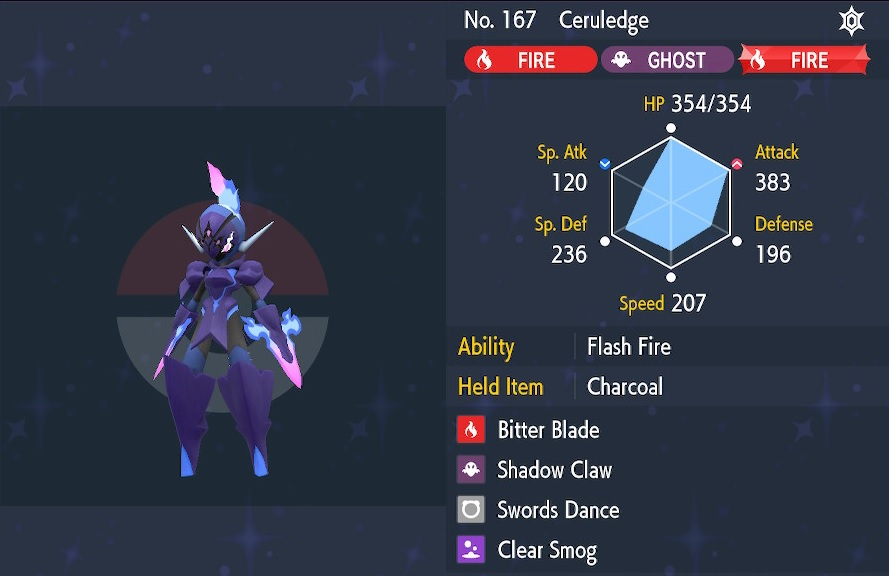
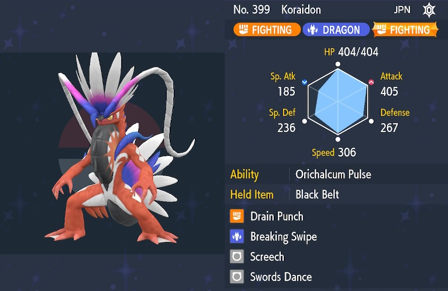
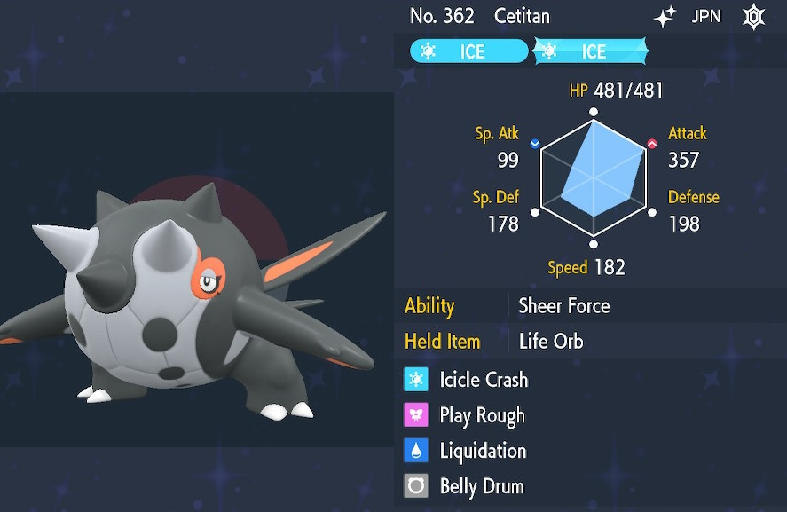
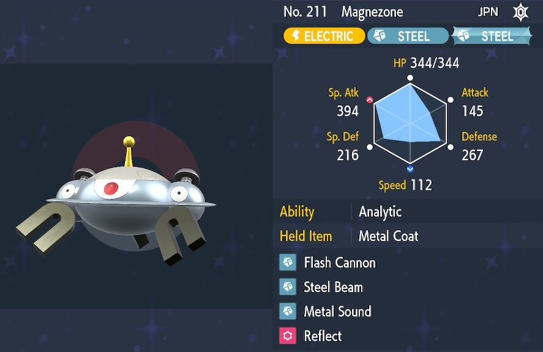

These are the attacker pokemon builds I've made for Tera Raids. - ※ Last updated December 29th, 2022.

Stat abbreviations: Atk - Attack, Def - Defense, SpA - Sp. Atk, SpD - Sp. Def, Spe - Speed

# Randoms

## Builds for Online (Randoms)

### Physical

<table class="buildsTable">
  <tr>
    <td rowspan="7" class="highlightNavy buildImage"></td>
    <td class="highlightGray">Name</td>
    <td>Iron Hands</td>
    <td class="highlightGray">Notes</td>
  </tr>
  <tr>
    <td class="highlightGray">Item</td>
    <td>Booster Energy / Life Orb Black Belt / Sitrus Berry</td>
    <td rowspan="6">Electric Terrain activates Quark Drive and grants sleep immunity to party.  If there are other belly drum users, use Hang Tough! to reduce damage, then Belly Drum after ally stats reset.  However, if there are Screech users, it's fine to aim for the one-shot.  Swap Thunder Punch with Close Combat if you want more power, but then make a 2nd one for Electric.</td>
  </tr>
  <tr>
    <td class="highlightGray">Tera</td>
    <td>Fighting</td>
  </tr>
  <tr>
    <td class="highlightGray">Ability</td>
    <td>Quark Drive</td>
  </tr>
  <tr>
    <td class="highlightGray">Nature</td>
    <td>Adamant (+Atk, -SpA)</td>
  </tr>
  <tr>
    <td class="highlightGray">EVs</td>
    <td>76 HP, 252 Atk, 4 Def, 176 SpD</td>
  </tr>
  <tr>
    <td class="highlightGray">Moves</td>
    <td>- Drain Punch  - Thunder Punch  - Belly Drum - Electric Terrain</td>
  </tr>
</table>

 

<table class="buildsTable">
  <tr>
    <td rowspan="7" class="highlightNavy buildImage"></td>
    <td class="highlightGray">Name</td>
    <td>Azumarill</td>
    <td class="highlightGray">Notes</td>
  </tr>
  <tr>
    <td class="highlightGray">Item</td>
    <td>Sitrus Berry / Shell Bell</td>
    <td rowspan="6">Tera Fairy is best for general use, but Water is great for water-weak bosses when combined with Rain Dance.  Rain Dance raises the accuracy of Hurricane and Thunder to 100%.</td>
  </tr>
  <tr>
    <td class="highlightGray">Tera</td>
    <td>Fairy or Water</td>
  </tr>
  <tr>
    <td class="highlightGray">Ability</td>
    <td>Huge Power</td>
  </tr>
  <tr>
    <td class="highlightGray">Nature</td>
    <td>Adamant (+Atk, -SpA)</td>
  </tr>
  <tr>
    <td class="highlightGray">EVs</td>
    <td>252 HP, 252 Atk, 4 Def</td>
  </tr>
  <tr>
    <td class="highlightGray">Moves</td>
    <td>- Play Rough  - Liquidation  - Belly Drum - Rain Dance</td>
  </tr>
</table>

 

<table class="buildsTable">
  <tr>
    <td rowspan="7" class="highlightNavy buildImage"></td>
    <td class="highlightGray">Name</td>
    <td>Ceruledge</td>
    <td class="highlightGray">Notes</td>
  </tr>
  <tr>
    <td class="highlightGray">Item</td>
    <td>Charcoal / Metronome</td>
    <td rowspan="6">Shadow Claw can be swapped with Sunny Day or Reflect if desired.  Don't use Clear Smog if the boss has been debuffed - Press Y to check if you're unsure.  Great against Tauros (Blaze Breed) and Flareon in particular.  Metronome is best for solo.</td>
  </tr>
  <tr>
    <td class="highlightGray">Tera</td>
    <td>Fire</td>
  </tr>
  <tr>
    <td class="highlightGray">Ability</td>
    <td>Flash Fire</td>
  </tr>
  <tr>
    <td class="highlightGray">Nature</td>
    <td>Adamant (+Atk, -SpA)</td>
  </tr>
  <tr>
    <td class="highlightGray">EVs</td>
    <td>252 HP, 252 Atk, 4 Spe</td>
  </tr>
  <tr>
    <td class="highlightGray">Moves</td>
    <td>- Bitter Blade  - Shadow Claw  - Swords Dance - Clear Smog </td>
  </tr>
</table>

 

<table class="buildsTable">
  <tr>
    <td rowspan="7" class="highlightNavy buildImage"></td>
    <td class="highlightGray">Name</td>
    <td>Annihilape</td>
    <td class="highlightGray">Notes</td>
  </tr>
  <tr>
    <td class="highlightGray">Item</td>
    <td>Spell Tag / Clear Amulet Shell Bell / Covert Cloak</td>
    <td rowspan="6">Rage Fist gains 50 BP each time you get hit up to 350 BP, which doesn't reset even if you faint.  Bulk Up is better for solo since NPCs never use Heal Up!  Don't use Clear Amulet if you go with Defiant for your ability.</td>
  </tr>
  <tr>
    <td class="highlightGray">Tera</td>
    <td>Ghost</td>
  </tr>
  <tr>
    <td class="highlightGray">Ability</td>
    <td>Vital Spirit / Defiant (HA)</td>
  </tr>
  <tr>
    <td class="highlightGray">Nature</td>
    <td>Adamant (+Atk, -SpA)</td>
  </tr>
  <tr>
    <td class="highlightGray">EVs</td>
    <td>252 HP, 252 Atk, 4 Def</td>
  </tr>
  <tr>
    <td class="highlightGray">Moves</td>
    <td>- Rage Fist  - Drain Punch  - Screech / Bulk Up - Taunt</td>
  </tr>
</table>

 

<table class="buildsTable">
  <tr>
    <td rowspan="7" class="highlightNavy buildImage"></td>
    <td class="highlightGray">Name</td>
    <td>Koraidon</td>
    <td class="highlightGray">Notes</td>
  </tr>
  <tr>
    <td class="highlightGray">Item</td>
    <td>Black Belt / Life Orb</td>
    <td rowspan="6">Orichalcum Pulse sets sun on entry.  Breaking Swipe lowers Atk by 1 stage even when the boss has a shield, but can be swapped with Collision Course for more power if you want.</td>
  </tr>
  <tr>
    <td class="highlightGray">Tera</td>
    <td>Fighting</td>
  </tr>
  <tr>
    <td class="highlightGray">Ability</td>
    <td>Orichalcum Pulse</td>
  </tr>
  <tr>
    <td class="highlightGray">Nature</td>
    <td>Adamant (+Atk, -SpA)</td>
  </tr>
  <tr>
    <td class="highlightGray">EVs</td>
    <td>252 HP, 252 Atk, 4 SpD</td>
  </tr>
  <tr>
    <td class="highlightGray">Moves</td>
    <td>- Drain Punch  - Breaking Swipe  - Screech - Swords Dance</td>
  </tr>
</table>

 

<table class="buildsTable">
  <tr>
    <td rowspan="7" class="highlightNavy buildImage"></td>
    <td class="highlightGray">Name</td>
    <td>Tinkaton</td>
    <td class="highlightGray">Notes</td>
  </tr>
  <tr>
    <td class="highlightGray">Item</td>
    <td>Metal Coat</td>
    <td rowspan="6">Gigaton Hammer has 160 BP but can't be used twice in a row, so the idea is to sandwich other moves between uses.  That said, don't immediately attack the boss without buffing yourself first.  Even better if there are Perrserkers.  234 speed lets you outspeed neutral nature Maushold if you care about it.</td>
  </tr>
  <tr>
    <td class="highlightGray">Tera</td>
    <td>Steel</td>
  </tr>
  <tr>
    <td class="highlightGray">Ability</td>
    <td>Mold Breaker</td>
  </tr>
  <tr>
    <td class="highlightGray">Nature</td>
    <td>Adamant (+Atk, -SpA)</td>
  </tr>
  <tr>
    <td class="highlightGray">EVs</td>
    <td>216 HP, 252 Atk, 36 Spe</td>
  </tr>
  <tr>
    <td class="highlightGray">Moves</td>
    <td>- Gigaton Hammer  - Play Rough  - Swords Dance - Reflect / Light Screen</td>
  </tr>
</table>

 

<table class="buildsTable">
  <tr>
    <td rowspan="7" class="highlightNavy buildImage"></td>
    <td class="highlightGray">Name</td>
    <td>Cetitan</td>
    <td class="highlightGray">Notes</td>
  </tr>
  <tr>
    <td class="highlightGray">Item</td>
    <td>Life Orb</td>
    <td rowspan="6">Sheer Force boosts power of moves with secondary effects by x1.3 and negates damage from Life Orb.  Other options include Heavy Slam, Earthquake, and Superpower, but none of these gain the power boost from Sheer Force.</td>
  </tr>
  <tr>
    <td class="highlightGray">Tera</td>
    <td>Ice</td>
  </tr>
  <tr>
    <td class="highlightGray">Ability</td>
    <td>Sheer Force (HA)</td>
  </tr>
  <tr>
    <td class="highlightGray">Nature</td>
    <td>Adamant (+Atk, -SpA)</td>
  </tr>
  <tr>
    <td class="highlightGray">EVs</td>
    <td>252 Atk, 128 Def, 128 SpD</td>
  </tr>
  <tr>
    <td class="highlightGray">Moves</td>
    <td>- Icicle Crash  - Play Rough  - Liquidation  - Belly Drum</td>
  </tr>
</table>

 

<table class="buildsTable">
  <tr>
    <td rowspan="7" class="highlightNavy buildImage"></td>
    <td class="highlightGray">Name</td>
    <td>Kingambit</td>
    <td class="highlightGray">Notes</td>
  </tr>
  <tr>
    <td class="highlightGray">Item</td>
    <td>Shell Bell</td>
    <td rowspan="6">Simple attacker for ghost raids or such.  Taunt is a bit wasted unless you invest EVs in speed, so Metal Sound is an option to help special attackers.  Beware of Fighting type moves.</td>
  </tr>
  <tr>
    <td class="highlightGray">Tera</td>
    <td>Dark or Steel</td>
  </tr>
  <tr>
    <td class="highlightGray">Ability</td>
    <td>Defiant</td>
  </tr>
  <tr>
    <td class="highlightGray">Nature</td>
    <td>Adamant (+Atk, -SpA)</td>
  </tr>
  <tr>
    <td class="highlightGray">EVs</td>
    <td>216 HP, 252 Atk, 36 Spe</td>
  </tr>
  <tr>
    <td class="highlightGray">Moves</td>
    <td>- Kowtow Cleave  - Iron Head  - Swords Dance - Taunt / Metal Sound</td>
  </tr>
</table>

 

<table class="buildsTable">
  <tr>
    <td rowspan="7" class="highlightNavy buildImage"></td>
    <td class="highlightGray">Name</td>
    <td>Perrserker</td>
    <td class="highlightGray">Notes</td>
  </tr>
  <tr>
    <td class="highlightGray">Item</td>
    <td>Wide Lens / Metal Coat</td>
    <td rowspan="6">Steely Spirit boosts the power of Steel type attacks by x1.5 and stacks with multiple Perrserkers.  Screech and Helping Hand are nice if there's a Belly Drum user or such, but Fake Tears is also an option if you team with Magnezone or Gholdengo.  You could build it as a pure support rather than an attacker if desired.</td>
  </tr>
  <tr>
    <td class="highlightGray">Tera</td>
    <td>Steel</td>
  </tr>
  <tr>
    <td class="highlightGray">Ability</td>
    <td>Steely Spirit (HA)</td>
  </tr>
  <tr>
    <td class="highlightGray">Nature</td>
    <td>Adamant (+Atk, -SpA)</td>
  </tr>
  <tr>
    <td class="highlightGray">EVs</td>
    <td>252 HP, 252 Atk, 4 SpD</td>
  </tr>
  <tr>
    <td class="highlightGray">Moves</td>
    <td>- Iron Head  - Screech - Swords Dance - Helping Hand / Taunt</td>
  </tr>
</table>

 

<table class="buildsTable">
  <tr>
    <td rowspan="7" class="highlightNavy buildImage"></td>
    <td class="highlightGray">Name</td>
    <td>Iron Thorns</td>
    <td class="highlightGray">Notes</td>
  </tr>
  <tr>
    <td class="highlightGray">Item</td>
    <td>Booster Energy</td>
    <td rowspan="6">Main attacks have low BP, but can hit hard with some buffs / debuffs.  Include Earthquake or Iron Head if you want more coverage.  Overall, not bad but doesn't stand out.</td>
  </tr>
  <tr>
    <td class="highlightGray">Tera</td>
    <td>Electric or Rock</td>
  </tr>
  <tr>
    <td class="highlightGray">Ability</td>
    <td>Quark Drive</td>
  </tr>
  <tr>
    <td class="highlightGray">Nature</td>
    <td>Adamant (+Atk, -SpA)</td>
  </tr>
  <tr>
    <td class="highlightGray">EVs</td>
    <td>236 HP, 252 Atk, 20 SpD</td>
  </tr>
  <tr>
    <td class="highlightGray">Moves</td>
    <td>- Thunder Punch  - Rock Slide  - Screech - Swords Dance</td>
  </tr>
</table>

 

<table class="buildsTable">
  <tr>
    <td rowspan="7" class="highlightNavy buildImage"></td>
    <td class="highlightGray">Name</td>
    <td>Garchomp</td>
    <td class="highlightGray">Notes</td>
  </tr>
  <tr>
    <td class="highlightGray">Item</td>
    <td>Soft Sand / Shell Bell</td>
    <td rowspan="6">Simple attacker for Earth-weak bosses.  Not that good, honestly.</td>
  </tr>
  <tr>
    <td class="highlightGray">Tera</td>
    <td>Ground</td>
  </tr>
  <tr>
    <td class="highlightGray">Ability</td>
    <td>Sand Veil</td>
  </tr>
  <tr>
    <td class="highlightGray">Nature</td>
    <td>Adamant (+Atk, -SpA)</td>
  </tr>
  <tr>
    <td class="highlightGray">EVs</td>
    <td>252 HP, 252 Atk, 4 SpD</td>
  </tr>
  <tr>
    <td class="highlightGray">Moves</td>
    <td>- Earthquake  - Dragon Claw  - Crunch  - Swords Dance</td>
  </tr>
</table>

 

<table class="buildsTable">
  <tr>
    <td rowspan="7" class="highlightNavy buildImage"></td>
    <td class="highlightGray">Name</td>
    <td>Charizard</td>
    <td class="highlightGray">Notes</td>
  </tr>
  <tr>
    <td class="highlightGray">Item</td>
    <td>Sitrus Berry</td>
    <td rowspan="6">You'll faint if you use Flare Blitz.  It can one-shot Fire-weak bosses in sunlight, but may need Screech. Koraidon is a perfect partner.  Overall, not that good.</td>
  </tr>
  <tr>
    <td class="highlightGray">Tera</td>
    <td>Fire</td>
  </tr>
  <tr>
    <td class="highlightGray">Ability</td>
    <td>Blaze</td>
  </tr>
  <tr>
    <td class="highlightGray">Nature</td>
    <td>Adamant (+Atk, -SpA)</td>
  </tr>
  <tr>
    <td class="highlightGray">EVs</td>
    <td>252 HP, 252 Atk, 4 Def</td>
  </tr>
  <tr>
    <td class="highlightGray">Moves</td>
    <td>- Acrobatics  - Fire Punch  - Flare Blitz  - Belly Drum</td>
  </tr>
</table>

### Special

<table class="buildsTable">
  <tr>
    <td rowspan="7" class="highlightNavy buildImage"></td>
    <td class="highlightGray">Name</td>
    <td>Iron Moth</td>
    <td class="highlightGray">Notes</td>
  </tr>
  <tr>
    <td class="highlightGray">Item</td>
    <td>Booster Energy</td>
    <td rowspan="6">Electric Terrain activates Quark Drive and grants sleep immunity to party.  Acid Spray lowers SpD by 2 stages even when the boss has a shield.  Fiery Dance has a 50% chance to raise SpA by 1 stage each time you use it.  Tera Poison is great against Amoonguss.</td>
  </tr>
  <tr>
    <td class="highlightGray">Tera</td>
    <td>Poison or Fire</td>
  </tr>
  <tr>
    <td class="highlightGray">Ability</td>
    <td>Quark Drive</td>
  </tr>
  <tr>
    <td class="highlightGray">Nature</td>
    <td>Modest (+SpA, -Atk)</td>
  </tr>
  <tr>
    <td class="highlightGray">EVs</td>
    <td>252 HP, 252 SpA, 4 Spe</td>
  </tr>
  <tr>
    <td class="highlightGray">Moves</td>
    <td>- Sludge Wave  - Fiery Dance  - Acid Spray  - Electric Terrain</td>
  </tr>
</table>

 

<table class="buildsTable">
  <tr>
    <td rowspan="7" class="highlightNavy buildImage"></td>
    <td class="highlightGray">Name</td>
    <td>Flutter Mane</td>
    <td class="highlightGray">Notes</td>
  </tr>
  <tr>
    <td class="highlightGray">Item</td>
    <td>Booster Energy / Covert Cloak</td>
    <td rowspan="6">Mystical Fire lowers SpA by 1 stage even when the boss has a shield.  Low HP and Def, so don't bring it to a boss with strong physical attacks.</td>
  </tr>
  <tr>
    <td class="highlightGray">Tera</td>
    <td>Fairy</td>
  </tr>
  <tr>
    <td class="highlightGray">Ability</td>
    <td>Protosynthesis</td>
  </tr>
  <tr>
    <td class="highlightGray">Nature</td>
    <td>Modest (+SpA, -Atk)</td>
  </tr>
  <tr>
    <td class="highlightGray">EVs</td>
    <td>252 HP, 252 SpA, 4 SpD</td>
  </tr>
  <tr>
    <td class="highlightGray">Moves</td>
    <td>- Moonblast  - Draining Kiss  - Fake Tears - Mystical Fire </td>
  </tr>
</table>

 

<table class="buildsTable">
  <tr>
    <td rowspan="7" class="highlightNavy buildImage"></td>
    <td class="highlightGray">Name</td>
    <td>Sylveon</td>
    <td class="highlightGray">Notes</td>
  </tr>
  <tr>
    <td class="highlightGray">Item</td>
    <td>Expert Belt / Covert Cloak</td>
    <td rowspan="6">You're unlikely to one-shot the boss with Hyper Beam with randoms, so don't bother trying for it.  Light Screen is better for party play, but Calm Mind can be used once to raise both SpA and SpD by 1 stage.  Don't waste lots of time doing buffs and debuffs - Terastallizing is often more important.</td>
  </tr>
  <tr>
    <td class="highlightGray">Tera</td>
    <td>Fairy</td>
  </tr>
  <tr>
    <td class="highlightGray">Ability</td>
    <td>Pixilate (HA)</td>
  </tr>
  <tr>
    <td class="highlightGray">Nature</td>
    <td>Modest (+SpA, -Atk)</td>
  </tr>
  <tr>
    <td class="highlightGray">EVs</td>
    <td>252 HP, 252 SpA, 4 SpD</td>
  </tr>
  <tr>
    <td class="highlightGray">Moves</td>
    <td>- Hyper Voice  - Fake Tears - Calm Mind / Light Screen - Misty Terrain</td>
  </tr>
</table>

 

<table class="buildsTable">
  <tr>
    <td rowspan="7" class="highlightNavy buildImage"></td>
    <td class="highlightGray">Name</td>
    <td>Miraidon</td>
    <td class="highlightGray">Notes</td>
  </tr>
  <tr>
    <td class="highlightGray">Item</td>
    <td>Magnet / Life Orb</td>
    <td rowspan="6">Miraidon outspeeds every boss that has Taunt in its move set, so you can Taunt to protect slower support allies.  Only use Metal Sound once unless there are other special attackers. It's important to Terastallize quickly.</td>
  </tr>
  <tr>
    <td class="highlightGray">Tera</td>
    <td>Electric</td>
  </tr>
  <tr>
    <td class="highlightGray">Ability</td>
    <td>Hadron Engine</td>
  </tr>
  <tr>
    <td class="highlightGray">Nature</td>
    <td>Modest (+SpA, -Atk)</td>
  </tr>
  <tr>
    <td class="highlightGray">EVs</td>
    <td>252 HP, 252 SpA, 4 Def</td>
  </tr>
  <tr>
    <td class="highlightGray">Moves</td>
    <td>- Electro Drift  - Parabolic Charge  - Metal Sound - Taunt / Reflect</td>
  </tr>
</table>

 

<table class="buildsTable">
  <tr>
    <td rowspan="7" class="highlightNavy buildImage"></td>
    <td class="highlightGray">Name</td>
    <td>Gholdengo</td>
    <td class="highlightGray">Notes</td>
  </tr>
  <tr>
    <td class="highlightGray">Item</td>
    <td>Metal Coat</td>
    <td rowspan="6">Good as Gold protects against status moves, but you lose it for 1 turn when the boss does a player reset.  Don't get too greedy with buffs and debuffs when playing with randoms.  Most bosses wipe buffs after 180 sec and wipe debuffs at 50% HP.</td>
  </tr>
  <tr>
    <td class="highlightGray">Tera</td>
    <td>Steel</td>
  </tr>
  <tr>
    <td class="highlightGray">Ability</td>
    <td>Good as Gold</td>
  </tr>
  <tr>
    <td class="highlightGray">Nature</td>
    <td>Modest (+SpA, -Atk)</td>
  </tr>
  <tr>
    <td class="highlightGray">EVs</td>
    <td>252 HP, 252 SpA, 4 Spe</td>
  </tr>
  <tr>
    <td class="highlightGray">Moves</td>
    <td>- Make It Rain  - Shadow Ball  - Nasty Plot - Metal Sound</td>
  </tr>
</table>

 

<table class="buildsTable">
  <tr>
    <td rowspan="7" class="highlightNavy buildImage"></td>
    <td class="highlightGray">Name</td>
    <td>Magnezone</td>
    <td class="highlightGray">Notes</td>
  </tr>
  <tr>
    <td class="highlightGray">Item</td>
    <td>Metal Coat</td>
    <td rowspan="6">Analytic boosts attack power by 30% if you move last, so 0 Speed IV and Quiet nature is best if you use it.  Metal Sound lowers SpD by 2 stages, but doesn't work on shield.  Steel Beam is mainly only used when aiming for a one-shot. Swap it with an electric type attack if desired.</td>
  </tr>
  <tr>
    <td class="highlightGray">Tera</td>
    <td>Steel</td>
  </tr>
  <tr>
    <td class="highlightGray">Ability</td>
    <td>Analytic (HA)</td>
  </tr>
  <tr>
    <td class="highlightGray">Nature</td>
    <td>Quiet (+SpA, -Spe)</td>
  </tr>
  <tr>
    <td class="highlightGray">EVs</td>
    <td>252 HP, 252 SpA, 4 Def</td>
  </tr>
  <tr>
    <td class="highlightGray">Moves</td>
    <td>- Flash Cannon  - Steel Beam  - Metal Sound - Reflect / Light Screen</td>
  </tr>
</table>

 

<table class="buildsTable">
  <tr>
    <td rowspan="7" class="highlightNavy buildImage"></td>
    <td class="highlightGray">Name</td>
    <td>Bellibolt</td>
    <td class="highlightGray">Notes</td>
  </tr>
  <tr>
    <td class="highlightGray">Item</td>
    <td>Metronome</td>
    <td rowspan="6">Electromorphosis grants charged status when you get hit, boosting the power of your next Electric type move by 100% - But it doesn't raise SpD.  Support moves are included in case the party is struggling, but prioritize repeated Parabolic Charge usage to build Metronome's power boost.  Also works pretty well for solo.</td>
  </tr>
  <tr>
    <td class="highlightGray">Tera</td>
    <td>Electric</td>
  </tr>
  <tr>
    <td class="highlightGray">Ability</td>
    <td>Electromorphosis</td>
  </tr>
  <tr>
    <td class="highlightGray">Nature</td>
    <td>Modest (+SpA, -Atk)</td>
  </tr>
  <tr>
    <td class="highlightGray">EVs</td>
    <td>252 HP, 252 SpA, 4 Def</td>
  </tr>
  <tr>
    <td class="highlightGray">Moves</td>
    <td>- Parabolic Charge  - Acid Spray  - Reflect / Light Screen - Electric Terrain</td>
  </tr>
</table>

 

<table class="buildsTable">
  <tr>
    <td rowspan="7" class="highlightNavy buildImage"></td>
    <td class="highlightGray">Name</td>
    <td>Espathra</td>
    <td class="highlightGray">Notes</td>
  </tr>
  <tr>
    <td class="highlightGray">Item</td>
    <td>Shell Bell</td>
    <td rowspan="6">Lumina Crash lowers SpD by 2 stages even when the boss has a shield.  Opportunist is better on paper, but copying every Hone Claws, Bulk Up, Dragon Dance, Swords Dance, etc. wastes a lot of time, so I prefer Frisk.  Only use Skill Swap with Frisk.</td>
  </tr>
  <tr>
    <td class="highlightGray">Tera</td>
    <td>Psychic</td>
  </tr>
  <tr>
    <td class="highlightGray">Ability</td>
    <td>Frisk / Opportunist</td>
  </tr>
  <tr>
    <td class="highlightGray">Nature</td>
    <td>Modest (+SpA, -Atk)</td>
  </tr>
  <tr>
    <td class="highlightGray">EVs</td>
    <td>252 HP, 252 SpA, 4 Def</td>
  </tr>
  <tr>
    <td class="highlightGray">Moves</td>
    <td>- Lumina Crash  - Reflect - Light Screen - Roost / Skill Swap</td>
  </tr>
</table>

 

<table class="buildsTable">
  <tr>
    <td rowspan="7" class="highlightNavy buildImage"></td>
    <td class="highlightGray">Name</td>
    <td>Charizard</td>
    <td class="highlightGray">Notes</td>
  </tr>
  <tr>
    <td class="highlightGray">Item</td>
    <td>Shell Bell</td>
    <td rowspan="6">Solar Power boosts SpA by x1.5 in sun, and sunlight boosts fire moves by x1.5, so it's nice against Fire-weak bosses.  Charizard has low defenses, so use Hang Tough! if no one else does.</td>
  </tr>
  <tr>
    <td class="highlightGray">Tera</td>
    <td>Fire</td>
  </tr>
  <tr>
    <td class="highlightGray">Ability</td>
    <td>Solar Power (HA)</td>
  </tr>
  <tr>
    <td class="highlightGray">Nature</td>
    <td>Modest (+SpA, -Atk)</td>
  </tr>
  <tr>
    <td class="highlightGray">EVs</td>
    <td>252 HP, 252 SpA, 4 Def</td>
  </tr>
  <tr>
    <td class="highlightGray">Moves</td>
    <td>- Flamethrower  - Air Slash  - Blast Burn  - Sunny Day</td>
  </tr>
</table>

 

<table class="buildsTable">
  <tr>
    <td rowspan="7" class="highlightNavy buildImage"></td>
    <td class="highlightGray">Name</td>
    <td>Skeledirge</td>
    <td class="highlightGray">Notes</td>
  </tr>
  <tr>
    <td class="highlightGray">Item</td>
    <td>Metronome / Shell Bell</td>
    <td rowspan="6">Torch Song raises SpA by 1 stage.  Unaware is a bit of a double-edged sword since it ignores both buffs and debuffs. Still, it's useful against bosses that use Calm Mind, etc.  Will-O-Wisp is to reduce attack power of physical bosses.</td>
  </tr>
  <tr>
    <td class="highlightGray">Tera</td>
    <td>Fire</td>
  </tr>
  <tr>
    <td class="highlightGray">Ability</td>
    <td>Unaware (HA)</td>
  </tr>
  <tr>
    <td class="highlightGray">Nature</td>
    <td>Modest (+SpA, -Atk)</td>
  </tr>
  <tr>
    <td class="highlightGray">EVs</td>
    <td>252 HP, 252 SpA, 4 SpD</td>
  </tr>
  <tr>
    <td class="highlightGray">Moves</td>
    <td>- Torch Song  - Shadow Ball  - Earth Power  - Will-O-Wisp</td>
  </tr>
</table>

 

<table class="buildsTable">
  <tr>
    <td rowspan="7" class="highlightNavy buildImage"></td>
    <td class="highlightGray">Name</td>
    <td>Volcarona</td>
    <td class="highlightGray">Notes</td>
  </tr>
  <tr>
    <td class="highlightGray">Item</td>
    <td>Shell Bell</td>
    <td rowspan="6">Flame Body can inflict burn even when the boss has a shield.  Fiery Dance has a 50% chance to raise SpA by 1 stage each time you use it.  Swap Light Screen with Quiver Dance if you want a guaranteed power boost.  Screech is used to aim for a one-shot if there's a Belly Drum user.</td>
  </tr>
  <tr>
    <td class="highlightGray">Tera</td>
    <td>Bug or Fire</td>
  </tr>
  <tr>
    <td class="highlightGray">Ability</td>
    <td>Flame Body</td>
  </tr>
  <tr>
    <td class="highlightGray">Nature</td>
    <td>Modest (+SpA, -Atk)</td>
  </tr>
  <tr>
    <td class="highlightGray">EVs</td>
    <td>252 HP, 252 SpA, 4 Def</td>
  </tr>
  <tr>
    <td class="highlightGray">Moves</td>
    <td>- Bug Buzz  - Fiery Dance  - Light Screen - Screech</td>
  </tr>
</table>

### For Fun

<table class="buildsTable">
  <tr>
    <td rowspan="7" class="highlightNavy buildImage"></td>
    <td class="highlightGray">Name</td>
    <td>Zangoose</td>
    <td class="highlightGray">Notes</td>
  </tr>
  <tr>
    <td class="highlightGray">Item</td>
    <td>Toxic Orb</td>
    <td rowspan="6">Hidden ability boosts Atk by x1.5 which plays well with STAB Facade.  Zangoose can learn Belly Drum, but it's far too squishy to utilize it.  ※ Don't bring this to ★6~7 raids.</td>
  </tr>
  <tr>
    <td class="highlightGray">Tera</td>
    <td>Normal</td>
  </tr>
  <tr>
    <td class="highlightGray">Ability</td>
    <td>Toxic Boost (HA)</td>
  </tr>
  <tr>
    <td class="highlightGray">Nature</td>
    <td>Adamant (+Atk, -SpA)</td>
  </tr>
  <tr>
    <td class="highlightGray">EVs</td>
    <td>248 HP, 252 Atk, 8 Spe</td>
  </tr>
  <tr>
    <td class="highlightGray">Moves</td>
    <td>- Facade  - Poison Jab  - Close Combat  - Swords Dance</td>
  </tr>
</table>

 

<table class="buildsTable">
  <tr>
    <td rowspan="7" class="highlightNavy buildImage"></td>
    <td class="highlightGray">Name</td>
    <td>Ursaring</td>
    <td class="highlightGray">Notes</td>
  </tr>
  <tr>
    <td class="highlightGray">Item</td>
    <td>Flame Orb / Sitrus Berry</td>
    <td rowspan="6">Guts boosts Atk by x1.5 which plays well with STAB Facade.  Basically a better Zangoose, but still too squishy to be able to recommend it for higher difficulty raids.</td>
  </tr>
  <tr>
    <td class="highlightGray">Tera</td>
    <td>Normal</td>
  </tr>
  <tr>
    <td class="highlightGray">Ability</td>
    <td>Guts</td>
  </tr>
  <tr>
    <td class="highlightGray">Nature</td>
    <td>Adamant (+Atk, -SpA)</td>
  </tr>
  <tr>
    <td class="highlightGray">EVs</td>
    <td>204 HP, 252 Atk, 4 Def, 48 Spe</td>
  </tr>
  <tr>
    <td class="highlightGray">Moves</td>
    <td>- Facade  - Crunch  - Close Combat  - Belly Drum</td>
  </tr>
</table>

# Organized

## Builds for Organized Groups

※ No builds for organized groups at the moment.
