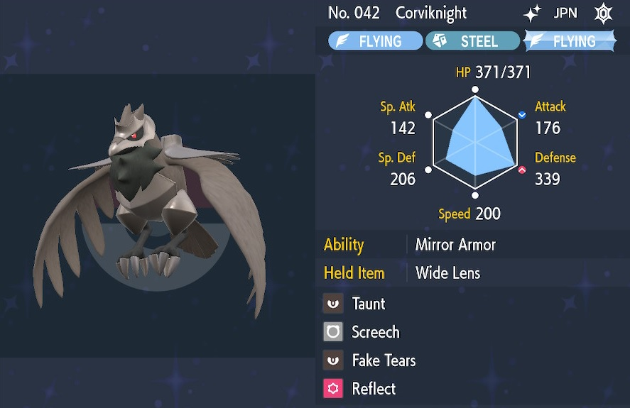
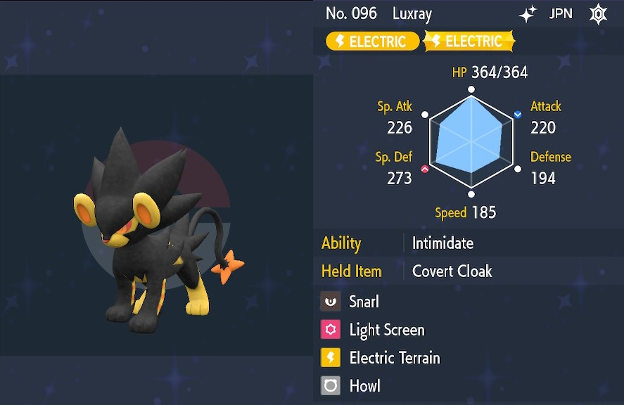
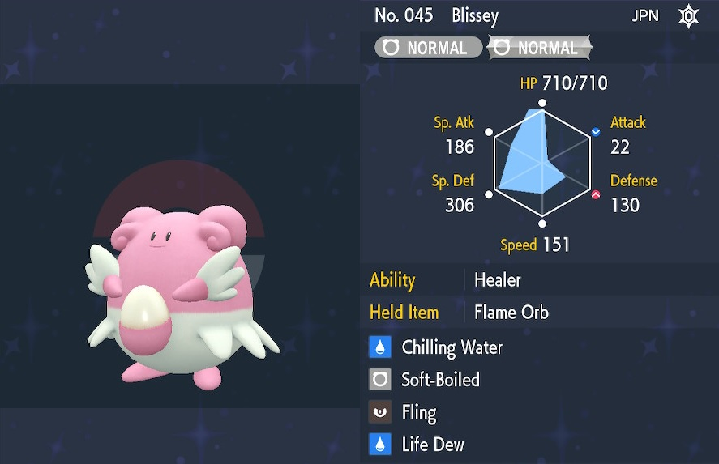
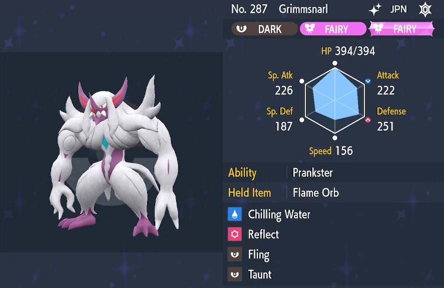

These are the support pokemon builds I've made for Tera Raids. - ※ Last updated December 29th, 2022.

Stat abbreviations: Atk - Attack, Def - Defense, SpA - Sp. Atk, SpD - Sp. Def, Spe - Speed

# Randoms

## Builds for Online (Randoms)

### Physical

<table class="buildsTable">
  <tr>
    <td rowspan="7" class="highlightNavy buildImage"></td>
    <td class="highlightGray">Name</td>
    <td>Umbreon</td>
    <td class="highlightGray">Notes</td>
  </tr>
  <tr>
    <td class="highlightGray">Item</td>
    <td>Light Clay / Wide Lens</td>
    <td rowspan="6">Taunt doesn't last long, and Screech doesn't work against a boss shield, so this build prefers a fast knockout.  If you need extended status protection or damage reduction beyond Reflect and cheers, use a different pokemon.</td>
  </tr>
  <tr>
    <td class="highlightGray">Tera</td>
    <td>Any</td>
  </tr>
  <tr>
    <td class="highlightGray">Ability</td>
    <td>Synchronize</td>
  </tr>
  <tr>
    <td class="highlightGray">Nature</td>
    <td>Bold (+Def, -Atk)</td>
  </tr>
  <tr>
    <td class="highlightGray">EVs</td>
    <td>252 HP, 252 Def, 4 Spe</td>
  </tr>
  <tr>
    <td class="highlightGray">Moves</td>
    <td>- Taunt - Screech / Fake Tears - Reflect - Helping Hand</td>
  </tr>
</table>

 

<table class="buildsTable">
  <tr>
    <td rowspan="7" class="highlightNavy buildImage"></td>
    <td class="highlightGray">Name</td>
    <td>Grimmsnarl</td>
    <td class="highlightGray">Notes</td>
  </tr>
  <tr>
    <td class="highlightGray">Item</td>
    <td>Light Clay</td>
    <td rowspan="6">Misty Terrain protects against status conditions for 5 turns.  Chilling Water lowers Atk by 1 stage even when the boss has a shield.  Taunt is mainly used against bosses that buff themselves or overwrite terrain, though there are better builds for bosses like Dragonite.</td>
  </tr>
  <tr>
    <td class="highlightGray">Tera</td>
    <td>Any</td>
  </tr>
  <tr>
    <td class="highlightGray">Ability</td>
    <td>Prankster</td>
  </tr>
  <tr>
    <td class="highlightGray">Nature</td>
    <td>Bold (+Def, -Atk)</td>
  </tr>
  <tr>
    <td class="highlightGray">EVs</td>
    <td>252 HP, 252 Def, 4 SpD</td>
  </tr>
  <tr>
    <td class="highlightGray">Moves</td>
    <td>- Chilling Water  - Reflect - Misty Terrain - Taunt</td>
  </tr>
</table>

 

<table class="buildsTable">
  <tr>
    <td rowspan="7" class="highlightNavy buildImage"></td>
    <td class="highlightGray">Name</td>
    <td>Corviknight</td>
    <td class="highlightGray">Notes</td>
  </tr>
  <tr>
    <td class="highlightGray">Item</td>
    <td>Wide Lens</td>
    <td rowspan="6">Taunt doesn't last long, and Screech doesn't work against a boss shield, so this build prefers a fast knockout.  If you need extended status protection or damage reduction beyond Reflect and cheers, use a different pokemon.  200 speed lets you outspeed +speed Bombirdier to stop Feather Dance. Feel free to lower it to 191 if you don't care about Bombirdier.</td>
  </tr>
  <tr>
    <td class="highlightGray">Tera</td>
    <td>Any</td>
  </tr>
  <tr>
    <td class="highlightGray">Ability</td>
    <td>Mirror Armor (HA)</td>
  </tr>
  <tr>
    <td class="highlightGray">Nature</td>
    <td>Bold (+Def, -Atk)</td>
  </tr>
  <tr>
    <td class="highlightGray">EVs</td>
    <td>136 HP, 252 Def, 120 Spe</td>
  </tr>
  <tr>
    <td class="highlightGray">Moves</td>
    <td>- Taunt - Screech - Fake Tears - Reflect</td>
  </tr>
</table>

 

<table class="buildsTable">
  <tr>
    <td rowspan="7" class="highlightNavy buildImage"></td>
    <td class="highlightGray">Name</td>
    <td>Polteageist</td>
    <td class="highlightGray">Notes</td>
  </tr>
  <tr>
    <td class="highlightGray">Item</td>
    <td>Wide Lens / Kasib Berry</td>
    <td rowspan="6">Push Weak Armor on to the boss, then use Will-O-Wisp.  Strength Sap doesn't work when the boss has a shield up.  215 speed lets you outspeed +speed nature Annihilape, but you could also go with lower speed and use Weak Armor's speed boost to outspeed it on turn 2.</td>
  </tr>
  <tr>
    <td class="highlightGray">Tera</td>
    <td>Any</td>
  </tr>
  <tr>
    <td class="highlightGray">Ability</td>
    <td>Weak Armor</td>
  </tr>
  <tr>
    <td class="highlightGray">Nature</td>
    <td>Timid (+Spe, -Atk)</td>
  </tr>
  <tr>
    <td class="highlightGray">EVs</td>
    <td>252 HP, 176 Def, 80 Spe</td>
  </tr>
  <tr>
    <td class="highlightGray">Moves</td>
    <td>- Skill Swap - Strength Sap / Reflect - Will-O-Wisp - Trick Room</td>
  </tr>
</table>

 

<table class="buildsTable">
  <tr>
    <td rowspan="7" class="highlightNavy buildImage"></td>
    <td class="highlightGray">Name</td>
    <td>Tsareena</td>
    <td class="highlightGray">Notes</td>
  </tr>
  <tr>
    <td class="highlightGray">Item</td>
    <td>Flame Orb</td>
    <td rowspan="6">Provides 3 types of damage reduction between stat drops, Reflect, and burn.  Wait until the 50% HP boss reset to inflict burn with Fling.  Helping Hand is nice so you can offer something once damage reduction is at a sufficient point.</td>
  </tr>
  <tr>
    <td class="highlightGray">Tera</td>
    <td>Any</td>
  </tr>
  <tr>
    <td class="highlightGray">Ability</td>
    <td>Sweet Veil (HA)</td>
  </tr>
  <tr>
    <td class="highlightGray">Nature</td>
    <td>Impish (+Def, -SpA)</td>
  </tr>
  <tr>
    <td class="highlightGray">EVs</td>
    <td>252 HP, 252 Def, 4 SpD</td>
  </tr>
  <tr>
    <td class="highlightGray">Moves</td>
    <td>- Trop Kick  - Reflect - Fling  - Helping Hand / Taunt</td>
  </tr>
</table>

 

<table class="buildsTable">
  <tr>
    <td rowspan="7" class="highlightNavy buildImage"></td>
    <td class="highlightGray">Name</td>
    <td>Slowbro</td>
    <td class="highlightGray">Notes</td>
  </tr>
  <tr>
    <td class="highlightGray">Item</td>
    <td>Flame Orb</td>
    <td rowspan="6">Flame Orb protects you from sleep and paralysis until thrown.  Wait until the 50% HP boss reset to inflict burn with Fling.  Skill Swap is mainly for Clear Body and Mirror Armor bosses.  97 speed lets you outspeed neutral nature Toxapex, Garganacl, and Dondozo.</td>
  </tr>
  <tr>
    <td class="highlightGray">Tera</td>
    <td>Any</td>
  </tr>
  <tr>
    <td class="highlightGray">Ability</td>
    <td>Regenerator (HA)</td>
  </tr>
  <tr>
    <td class="highlightGray">Nature</td>
    <td>Bold (+Def, -Atk)</td>
  </tr>
  <tr>
    <td class="highlightGray">EVs</td>
    <td>252 HP, 252 Def, 4 Spe</td>
  </tr>
  <tr>
    <td class="highlightGray">Moves</td>
    <td>- Chilling Water  - Helping Hand - Fling  - Skill Swap</td>
  </tr>
</table>

 

<table class="buildsTable">
  <tr>
    <td rowspan="7" class="highlightNavy buildImage"></td>
    <td class="highlightGray">Name</td>
    <td>Golduck</td>
    <td class="highlightGray">Notes</td>
  </tr>
  <tr>
    <td class="highlightGray">Item</td>
    <td>Wide Lens</td>
    <td rowspan="6">Similar to Umbreon, but trades Reflect for Chilling Water and has a different defensive typing.  Chilling Water lowers Atk by 1 stage even when the boss has a shield.  Skill Swap is mainly for Clear Body and Mirror Armor bosses.</td>
  </tr>
  <tr>
    <td class="highlightGray">Tera</td>
    <td>Any</td>
  </tr>
  <tr>
    <td class="highlightGray">Ability</td>
    <td>Damp</td>
  </tr>
  <tr>
    <td class="highlightGray">Nature</td>
    <td>Bold (+Def, -Atk)</td>
  </tr>
  <tr>
    <td class="highlightGray">EVs</td>
    <td>220 HP, 252 Def, 38 Spe</td>
  </tr>
  <tr>
    <td class="highlightGray">Moves</td>
    <td>- Chilling Water  - Screech - Skill Swap - Taunt</td>
  </tr>
</table>

 

<table class="buildsTable">
  <tr>
    <td rowspan="7" class="highlightNavy buildImage"></td>
    <td class="highlightGray">Name</td>
    <td>Sableye</td>
    <td class="highlightGray">Notes</td>
  </tr>
  <tr>
    <td class="highlightGray">Item</td>
    <td>Flame Orb</td>
    <td rowspan="6">Use Will-O-Wisp to halve damage taken, then when the boss gains shield and does the 2nd boss reset at 50% HP, use Fling to inflict burn again.  Skill Swapping Stall on to the boss ensures that the boss acts last.  As a bonus, Flame Orb protects you from sleep and paralysis.</td>
  </tr>
  <tr>
    <td class="highlightGray">Tera</td>
    <td>Any</td>
  </tr>
  <tr>
    <td class="highlightGray">Ability</td>
    <td>Stall</td>
  </tr>
  <tr>
    <td class="highlightGray">Nature</td>
    <td>Bold (+Def, -Atk)</td>
  </tr>
  <tr>
    <td class="highlightGray">EVs</td>
    <td>252 HP, 252 Def, 4 SpD</td>
  </tr>
  <tr>
    <td class="highlightGray">Moves</td>
    <td>- Will-O-Wisp - Reflect - Fling  - Skill Swap</td>
  </tr>
</table>

 

<table class="buildsTable">
  <tr>
    <td rowspan="7" class="highlightNavy buildImage"></td>
    <td class="highlightGray">Name</td>
    <td>Bruxish</td>
    <td class="highlightGray">Notes</td>
  </tr>
  <tr>
    <td class="highlightGray">Item</td>
    <td>Wide Lens</td>
    <td rowspan="6">Basically Golduck with Reflect instead of Skill Swap.  Psychic Fangs is an option, but as of this writing Psychic is weak against most bosses that use screens.  224 Speed lets you outspeed +speed nature Tinkaton to stop Thunder Wave.</td>
  </tr>
  <tr>
    <td class="highlightGray">Tera</td>
    <td>Any</td>
  </tr>
  <tr>
    <td class="highlightGray">Ability</td>
    <td>Dazzling</td>
  </tr>
  <tr>
    <td class="highlightGray">Nature</td>
    <td>Bold (+Def, -Atk)</td>
  </tr>
  <tr>
    <td class="highlightGray">EVs</td>
    <td>252 HP, 240 Def, 18 Spe</td>
  </tr>
  <tr>
    <td class="highlightGray">Moves</td>
    <td>- Chilling Water  - Screech - Reflect - Taunt</td>
  </tr>
</table>

### Special

<table class="buildsTable">
  <tr>
    <td rowspan="7" class="highlightNavy buildImage"></td>
    <td class="highlightGray">Name</td>
    <td>Umbreon</td>
    <td class="highlightGray">Notes</td>
  </tr>
  <tr>
    <td class="highlightGray">Item</td>
    <td>Light Clay / Wide Lens</td>
    <td rowspan="6">Taunt doesn't last long, and Screech doesn't work against a boss shield, so this build prefers a fast knockout unless you go with Snarl.  If you need extended status protection, use a different pokemon.</td>
  </tr>
  <tr>
    <td class="highlightGray">Tera</td>
    <td>Any</td>
  </tr>
  <tr>
    <td class="highlightGray">Ability</td>
    <td>Synchronize</td>
  </tr>
  <tr>
    <td class="highlightGray">Nature</td>
    <td>Calm (+SpD, -Atk)</td>
  </tr>
  <tr>
    <td class="highlightGray">EVs</td>
    <td>252 HP, 252 SpD, 4 Def</td>
  </tr>
  <tr>
    <td class="highlightGray">Moves</td>
    <td>- Taunt / Snarl  - Screech / Fake Tears - Light Screen - Helping Hand</td>
  </tr>
</table>

 

<table class="buildsTable">
  <tr>
    <td rowspan="7" class="highlightNavy buildImage"></td>
    <td class="highlightGray">Name</td>
    <td>Gardevoir</td>
    <td class="highlightGray">Notes</td>
  </tr>
  <tr>
    <td class="highlightGray">Item</td>
    <td>Light Clay</td>
    <td rowspan="6">Misty Terrain protects against status conditions for 5 turns.  Mystical Fire lowers SpA by 1 stage even when the boss has a shield.  Taunt is mainly used against bosses that buff themselves or overwrite terrain.</td>
  </tr>
  <tr>
    <td class="highlightGray">Tera</td>
    <td>Any</td>
  </tr>
  <tr>
    <td class="highlightGray">Ability</td>
    <td>Synchronize</td>
  </tr>
  <tr>
    <td class="highlightGray">Nature</td>
    <td>Calm (+SpD, -Atk)</td>
  </tr>
  <tr>
    <td class="highlightGray">EVs</td>
    <td>252 HP, 252 SpD, 4 Def</td>
  </tr>
  <tr>
    <td class="highlightGray">Moves</td>
    <td>- Mystical Fire  - Light Screen - Misty Terrain - Taunt</td>
  </tr>
</table>

 

<table class="buildsTable">
  <tr>
    <td rowspan="7" class="highlightNavy buildImage"></td>
    <td class="highlightGray">Name</td>
    <td>Grimmsnarl</td>
    <td class="highlightGray">Notes</td>
  </tr>
  <tr>
    <td class="highlightGray">Item</td>
    <td>Light Clay</td>
    <td rowspan="6">Misty Terrain protects against status conditions for 5 turns.  Spirit Break lowers SpA by 1 stage even when the boss has a shield.  Taunt is mainly used against bosses that buff themselves or overwrite terrain.  Basically the same as Gardevoir, but has a different defensive typing.</td>
  </tr>
  <tr>
    <td class="highlightGray">Tera</td>
    <td>Any</td>
  </tr>
  <tr>
    <td class="highlightGray">Ability</td>
    <td>Prankster</td>
  </tr>
  <tr>
    <td class="highlightGray">Nature</td>
    <td>Careful (+SpD, -SpA)</td>
  </tr>
  <tr>
    <td class="highlightGray">EVs</td>
    <td>252 HP, 252 SpD, 4 Def</td>
  </tr>
  <tr>
    <td class="highlightGray">Moves</td>
    <td>- Spirit Break  - Light Screen - Misty Terrain - Taunt</td>
  </tr>
</table>

 

<table class="buildsTable">
  <tr>
    <td rowspan="7" class="highlightNavy buildImage"></td>
    <td class="highlightGray">Name</td>
    <td>Blissey</td>
    <td class="highlightGray">Notes</td>
  </tr>
  <tr>
    <td class="highlightGray">Item</td>
    <td>Covert Cloak</td>
    <td rowspan="6">Electric Terrain activates Quark Drive and grants sleep immunity to party, but Skill Swap is another option for bosses like Kilowattrel.  Natural Cure is fine if you don't want to spend an Ability Patch.  151 speed lets you outspeed neutral nature Eeveelutions.</td>
  </tr>
  <tr>
    <td class="highlightGray">Tera</td>
    <td>Any</td>
  </tr>
  <tr>
    <td class="highlightGray">Ability</td>
    <td>Healer (HA)</td>
  </tr>
  <tr>
    <td class="highlightGray">Nature</td>
    <td>Calm (+SpD, -Atk)</td>
  </tr>
  <tr>
    <td class="highlightGray">EVs</td>
    <td>238 HP, 252 SpD, 20 Spe</td>
  </tr>
  <tr>
    <td class="highlightGray">Moves</td>
    <td>- Life Dew / Heal Pulse - Helping Hand - Light Screen - Electric Terrain</td>
  </tr>
</table>

 

<table class="buildsTable">
  <tr>
    <td rowspan="7" class="highlightNavy buildImage"></td>
    <td class="highlightGray">Name</td>
    <td>Hatterene</td>
    <td class="highlightGray">Notes</td>
  </tr>
  <tr>
    <td class="highlightGray">Item</td>
    <td>Covert Cloak</td>
    <td rowspan="6">Misty Terrain protects against status conditions for 5 turns.  Mystical Fire lowers SpA by 1 stage even when the boss has a shield.  Basically Gardevoir, but trades some speed for physical defense.  Nuzzle is an option to inflict paralysis through a boss shield.</td>
  </tr>
  <tr>
    <td class="highlightGray">Tera</td>
    <td>Any</td>
  </tr>
  <tr>
    <td class="highlightGray">Ability</td>
    <td>Magic Bounce (HA)</td>
  </tr>
  <tr>
    <td class="highlightGray">Nature</td>
    <td>Calm (+SpD, -Atk)</td>
  </tr>
  <tr>
    <td class="highlightGray">EVs</td>
    <td>238 HP, 252 SpD, 20 Spe</td>
  </tr>
  <tr>
    <td class="highlightGray">Moves</td>
    <td>- Mystical Fire  - Life Dew - Light Screen - Misty Terrain</td>
  </tr>
</table>

 

<table class="buildsTable">
  <tr>
    <td rowspan="7" class="highlightNavy buildImage"></td>
    <td class="highlightGray">Name</td>
    <td>Luxray</td>
    <td class="highlightGray">Notes</td>
  </tr>
  <tr>
    <td class="highlightGray">Item</td>
    <td>Covert Cloak</td>
    <td rowspan="6">Electric Terrain activates Quark Drive and grants sleep immunity to party.  Start with Hang Tough! if you don't need immediate sleep immunity or if the boss is faster, then Light Screen → Snarl.  Once damage reduction is plentiful, Howl to raise Atk of party by 1 stage.  People tend to disband the raid when you lock in Luxray, unfortunately. ※ Don't bring it to Kilowattrel.</td>
  </tr>
  <tr>
    <td class="highlightGray">Tera</td>
    <td>Any</td>
  </tr>
  <tr>
    <td class="highlightGray">Ability</td>
    <td>Intimidate</td>
  </tr>
  <tr>
    <td class="highlightGray">Nature</td>
    <td>Calm (+SpD, -Atk)</td>
  </tr>
  <tr>
    <td class="highlightGray">EVs</td>
    <td>252 HP, 220 SpD, 38 Spe</td>
  </tr>
  <tr>
    <td class="highlightGray">Moves</td>
    <td>- Snarl  - Light Screen - Electric Terrain - Howl / Helping Hand</td>
  </tr>
</table>

 

<table class="buildsTable">
  <tr>
    <td rowspan="7" class="highlightNavy buildImage"></td>
    <td class="highlightGray">Name</td>
    <td>Corviknight</td>
    <td class="highlightGray">Notes</td>
  </tr>
  <tr>
    <td class="highlightGray">Item</td>
    <td>Wide Lens</td>
    <td rowspan="6">Taunt doesn't last long, and Screech doesn't work against a boss shield, so this build prefers a fast knockout.  If you need extended status protection or damage reduction beyond cheers and Light Screen, use a different pokemon.  195 speed lets you outspeed +speed nature Gardevoir, but there are better supports for that boss, so it's fine to lower speed to 189 instead which lets you outspeed neutral Glimmora.</td>
  </tr>
  <tr>
    <td class="highlightGray">Tera</td>
    <td>Any</td>
  </tr>
  <tr>
    <td class="highlightGray">Ability</td>
    <td>Mirror Armor (HA)</td>
  </tr>
  <tr>
    <td class="highlightGray">Nature</td>
    <td>Calm (+SpD, -Atk)</td>
  </tr>
  <tr>
    <td class="highlightGray">EVs</td>
    <td>156 HP, 252 SpD, 100 Spe</td>
  </tr>
  <tr>
    <td class="highlightGray">Moves</td>
    <td>- Taunt - Screech - Fake Tears - Light Screen</td>
  </tr>
</table>

 

<table class="buildsTable">
  <tr>
    <td rowspan="7" class="highlightNavy buildImage"></td>
    <td class="highlightGray">Name</td>
    <td>Eelektross</td>
    <td class="highlightGray">Notes</td>
  </tr>
  <tr>
    <td class="highlightGray">Item</td>
    <td>Safety Goggles / Iron Ball Covert Cloak</td>
    <td rowspan="6">Invest in Def so it can be used against bosses with both physical and special attacks like Clawitzer.  Acid Spray lowers SpD by 2 stages even when the boss has a shield.  Eerie Impulse lowers SpA by 2 stages, but doesn't work on shield.  Run Electric Terrain if desired, but you won't gain sleep immunity unless you hold an Iron Ball.</td>
  </tr>
  <tr>
    <td class="highlightGray">Tera</td>
    <td>Any</td>
  </tr>
  <tr>
    <td class="highlightGray">Ability</td>
    <td>Levitate</td>
  </tr>
  <tr>
    <td class="highlightGray">Nature</td>
    <td>Bold (+Def, -Atk)</td>
  </tr>
  <tr>
    <td class="highlightGray">EVs</td>
    <td>252 HP, 136 Def, 96 SpD, 24 Spe</td>
  </tr>
  <tr>
    <td class="highlightGray">Moves</td>
    <td>- Acid Spray  - Eerie Impulse - Light Screen - Gastro Acid</td>
  </tr>
</table>

### Mixed

<table class="buildsTable">
  <tr>
    <td rowspan="7" class="highlightNavy buildImage"></td>
    <td class="highlightGray">Name</td>
    <td>Tsareena</td>
    <td class="highlightGray">Notes</td>
  </tr>
  <tr>
    <td class="highlightGray">Item</td>
    <td>Light Ball / Flame Orb</td>
    <td rowspan="6">Sweet Veil grants sleep immunity to the party while Tsareena is present.  Trop Kick lowers Atk by 1 stage even when the boss has a shield.  Use Fling after the boss gains shield and does the 2nd boss reset at 50% HP to inflict paralysis / burn.  Light Ball is obtained from wild Pikachu, though it's quite rare.</td>
  </tr>
  <tr>
    <td class="highlightGray">Tera</td>
    <td>Any</td>
  </tr>
  <tr>
    <td class="highlightGray">Ability</td>
    <td>Sweet Veil (HA)</td>
  </tr>
  <tr>
    <td class="highlightGray">Nature</td>
    <td>Calm (+SpD, -Atk)</td>
  </tr>
  <tr>
    <td class="highlightGray">EVs</td>
    <td>252 HP, 26 Def, 232 SpD</td>
  </tr>
  <tr>
    <td class="highlightGray">Moves</td>
    <td>- Trop Kick  - Reflect - Light Screen - Fling </td>
  </tr>
</table>

 

<table class="buildsTable">
  <tr>
    <td rowspan="7" class="highlightNavy buildImage"></td>
    <td class="highlightGray">Name</td>
    <td>Scream Tail</td>
    <td class="highlightGray">Notes</td>
  </tr>
  <tr>
    <td class="highlightGray">Item</td>
    <td>Light Clay</td>
    <td rowspan="6">Simple dual screens build with status protection via Misty Terrain.  Once screens are placed, use Helping Hand on the strongest attacker in the party until you hopefully win.  Don't use Energy Booster since it delays your input at the start of the fight.  261 speed lets you outspeed neutral nature Talonflame if you care about that.</td>
  </tr>
  <tr>
    <td class="highlightGray">Tera</td>
    <td>Any</td>
  </tr>
  <tr>
    <td class="highlightGray">Ability</td>
    <td>Protosynthesis</td>
  </tr>
  <tr>
    <td class="highlightGray">Nature</td>
    <td>Bold (+Def, -Atk)</td>
  </tr>
  <tr>
    <td class="highlightGray">EVs</td>
    <td>240 HP, 128 Def, 128 SpD, 12 Spe</td>
  </tr>
  <tr>
    <td class="highlightGray">Moves</td>
    <td>- Helping Hand - Reflect - Light Screen - Misty Terrain</td>
  </tr>
</table>

### For Fun

<table class="buildsTable">
  <tr>
    <td rowspan="7" class="highlightNavy buildImage"></td>
    <td class="highlightGray">Name</td>
    <td>Meowscarada</td>
    <td class="highlightGray">Notes</td>
  </tr>
  <tr>
    <td class="highlightGray">Item</td>
    <td>Covert Cloak / Flame Orb</td>
    <td rowspan="6">Use Chilling Water or Skill Swap to change to a better defensive type, then use Hang Tough!.  If you go with Flame Orb + Fling, wait until the 50% HP boss reset to inflict burn so it doesn't get wiped.  Pollen Puff can be used on an ally to heal 50% of their HP.  Requires boss knowledge to play, but very fun if given a chance.</td>
  </tr>
  <tr>
    <td class="highlightGray">Tera</td>
    <td>Any</td>
  </tr>
  <tr>
    <td class="highlightGray">Ability</td>
    <td>Protean (HA)</td>
  </tr>
  <tr>
    <td class="highlightGray">Nature</td>
    <td>Bold (+Def, -Atk)</td>
  </tr>
  <tr>
    <td class="highlightGray">EVs</td>
    <td>252 HP, 252 Def, 4 SpD</td>
  </tr>
  <tr>
    <td class="highlightGray">Moves</td>
    <td>- Taunt / Fling  - Chilling Water  - Pollen Puff  - Skill Swap</td>
  </tr>
</table>

 

<table class="buildsTable">
  <tr>
    <td rowspan="7" class="highlightNavy buildImage"></td>
    <td class="highlightGray">Name</td>
    <td>Dragonair</td>
    <td class="highlightGray">Notes</td>
  </tr>
  <tr>
    <td class="highlightGray">Item</td>
    <td>Eviolite</td>
    <td rowspan="6">Safeguard protects the party from status conditions for 5 turns.  Chilling Water lowers Atk by 1 stage even when the boss has a shield.  Honestly not that good, but I really like Dragonair so wanted to make a build to have some fun with.</td>
  </tr>
  <tr>
    <td class="highlightGray">Tera</td>
    <td>Any</td>
  </tr>
  <tr>
    <td class="highlightGray">Ability</td>
    <td>Marvel Scale (HA)</td>
  </tr>
  <tr>
    <td class="highlightGray">Nature</td>
    <td>Bold (+Def, -Atk)</td>
  </tr>
  <tr>
    <td class="highlightGray">EVs</td>
    <td>252 HP, 136 Def, 112 SpD, 8 Spe</td>
  </tr>
  <tr>
    <td class="highlightGray">Moves</td>
    <td>- Chilling Water  - Helping Hand - Light Screen - Safeguard</td>
  </tr>
</table>

 

<table class="buildsTable">
  <tr>
    <td rowspan="7" class="highlightNavy buildImage"></td>
    <td class="highlightGray">Name</td>
    <td>Palossand</td>
    <td class="highlightGray">Notes</td>
  </tr>
  <tr>
    <td class="highlightGray">Item</td>
    <td>Covert Cloak</td>
    <td rowspan="6">Remove boss's ability with Skill Swap, then use Hang Tough! once, followed by repeated Chilling Water usage.  Rain Dance or Sunny Day is just in case an ally changes the weather to a sandstorm for whatever reason.  Not as good as many other physical supports, but can be fun to use other pokemon sometimes.</td>
  </tr>
  <tr>
    <td class="highlightGray">Tera</td>
    <td>Any</td>
  </tr>
  <tr>
    <td class="highlightGray">Ability</td>
    <td>Sand Veil (HA)</td>
  </tr>
  <tr>
    <td class="highlightGray">Nature</td>
    <td>Bold (+Def, -Atk)</td>
  </tr>
  <tr>
    <td class="highlightGray">EVs</td>
    <td>252 HP, 252 Def, 4 SpD</td>
  </tr>
  <tr>
    <td class="highlightGray">Moves</td>
    <td>- Chilling Water  - Shore Up - Skill Swap - Rain Dance / Sunny Day</td>
  </tr>
</table>

 

<table class="buildsTable">
  <tr>
    <td rowspan="7" class="highlightNavy buildImage"></td>
    <td class="highlightGray">Name</td>
    <td>Blissey</td>
    <td class="highlightGray">Notes</td>
  </tr>
  <tr>
    <td class="highlightGray">Item</td>
    <td>Flame Orb</td>
    <td rowspan="6">Start with Hang Tough!, then use Chilling Water to reduce damage to the point where Life Dew at least breaks even when used.  Wait until the 2nd boss reset at 50% HP before using Fling to inflict burn - This is what makes Blissey better than Eviolite Chansey.  But there are better Fling supports, so this is mostly just for fun.</td>
  </tr>
  <tr>
    <td class="highlightGray">Tera</td>
    <td>Any</td>
  </tr>
  <tr>
    <td class="highlightGray">Ability</td>
    <td>Healer</td>
  </tr>
  <tr>
    <td class="highlightGray">Nature</td>
    <td>Bold (+Def, -Atk)</td>
  </tr>
  <tr>
    <td class="highlightGray">EVs</td>
    <td>238 HP, 252 Def, 20 Spe</td>
  </tr>
  <tr>
    <td class="highlightGray">Moves</td>
    <td>- Chilling Water  - Soft-Boiled - Fling  - Life Dew</td>
  </tr>
</table>

## Boss-Specific

#### VS Annihilape

<table class="buildsTable">
  <tr>
    <td rowspan="7" class="highlightNavy buildImage"></td>
    <td class="highlightGray">Name</td>
    <td>Oranguru</td>
    <td class="highlightGray">Notes</td>
  </tr>
  <tr>
    <td class="highlightGray">Item</td>
    <td>Flame Orb</td>
    <td rowspan="6">Turn 1 - Select your move ASAP: If there are no debuff users, Taunt. If there are debuff users, Skill Swap.  Use Hang Tough! and Reflect to reduce damage, but critical hits ignore screens and stat modifiers.  Once Annihilape does the 2nd boss reset at 50% HP, use Fling to inflict burn.  Bad teammates can still mess up the raid even if you play your part well.</td>
  </tr>
  <tr>
    <td class="highlightGray">Tera</td>
    <td>Any</td>
  </tr>
  <tr>
    <td class="highlightGray">Ability</td>
    <td>Telepathy</td>
  </tr>
  <tr>
    <td class="highlightGray">Nature</td>
    <td>Bold (+Def, -Atk)</td>
  </tr>
  <tr>
    <td class="highlightGray">EVs</td>
    <td>98 HP, 252 Def, 160 Spe</td>
  </tr>
  <tr>
    <td class="highlightGray">Moves</td>
    <td>- Taunt - Reflect - Fling  - Skill Swap</td>
  </tr>
</table>

#### VS Dragonite

<table class="buildsTable">
  <tr>
    <td rowspan="7" class="highlightNavy buildImage"></td>
    <td class="highlightGray">Name</td>
    <td>Grimmsnarl</td>
    <td class="highlightGray">Notes</td>
  </tr>
  <tr>
    <td class="highlightGray">Item</td>
    <td>Flame Orb</td>
    <td rowspan="6">Turn 1 - Select Taunt ASAP to prevent Dragon Dance usage.  Use Hang Tough!, Chilling Water, and Reflect to reduce damage.  Once Dragonite does the 2nd boss reset at 50% HP, use Fling to inflict burn.</td>
  </tr>
  <tr>
    <td class="highlightGray">Tera</td>
    <td>Any</td>
  </tr>
  <tr>
    <td class="highlightGray">Ability</td>
    <td>Prankster</td>
  </tr>
  <tr>
    <td class="highlightGray">Nature</td>
    <td>Bold (+Def, -Atk)</td>
  </tr>
  <tr>
    <td class="highlightGray">EVs</td>
    <td>252 HP, 252 Def, 4 SpD</td>
  </tr>
  <tr>
    <td class="highlightGray">Moves</td>
    <td>- Chilling Water  - Reflect - Fling  - Taunt</td>
  </tr>
</table>

#### VS Gardevoir

<table class="buildsTable">
  <tr>
    <td rowspan="7" class="highlightNavy buildImage"></td>
    <td class="highlightGray">Name</td>
    <td>Armarouge</td>
    <td class="highlightGray">Notes</td>
  </tr>
  <tr>
    <td class="highlightGray">Item</td>
    <td>Covert Cloak</td>
    <td rowspan="6">Turn 1 - Select Taunt ASAP to prevent Calm Mind and Thunder Wave usage.  Use Hang Tough!, Mystical Fire, and Light Screen to reduce damage.  Press Y to check Gardevoir's status periodically, and use Clear Smog if it has lots of Calm Minds stacked.</td>
  </tr>
  <tr>
    <td class="highlightGray">Tera</td>
    <td>Any</td>
  </tr>
  <tr>
    <td class="highlightGray">Ability</td>
    <td>Flash Fire</td>
  </tr>
  <tr>
    <td class="highlightGray">Nature</td>
    <td>Calm (+SpD, -Atk)</td>
  </tr>
  <tr>
    <td class="highlightGray">EVs</td>
    <td>220 HP, 252 SpD, 36 Spe</td>
  </tr>
  <tr>
    <td class="highlightGray">Moves</td>
    <td>- Mystical Fire  - Clear Smog  - Light Screen - Taunt</td>
  </tr>
</table>

#### VS Clodsire

<table class="buildsTable">
  <tr>
    <td rowspan="7" class="highlightNavy buildImage"></td>
    <td class="highlightGray">Name</td>
    <td>Spidops</td>
    <td class="highlightGray">Notes</td>
  </tr>
  <tr>
    <td class="highlightGray">Item</td>
    <td>Covert Cloak</td>
    <td rowspan="6">Gastro Acid erases the boss's ability which has a chance of being Unaware.  Taunt prevents Yawn usage for a bit, but otherwise use Hang Tough! and spam Lunge to reduce damage.  Sunny Day activates Protosynthesis if you have Scarlet paradox allies, and Covert Cloak protects you from poison.</td>
  </tr>
  <tr>
    <td class="highlightGray">Tera</td>
    <td>Any</td>
  </tr>
  <tr>
    <td class="highlightGray">Ability</td>
    <td>Insomnia</td>
  </tr>
  <tr>
    <td class="highlightGray">Nature</td>
    <td>Impish (+Def, -SpA)</td>
  </tr>
  <tr>
    <td class="highlightGray">EVs</td>
    <td>252 HP, 252 Def, 4 Atk</td>
  </tr>
  <tr>
    <td class="highlightGray">Moves</td>
    <td>- Lunge  - Gastro Acid - Taunt - Sunny Day</td>
  </tr>
</table>

# Organized

## Builds for Organized Groups

※ No builds for organized groups at the moment.
