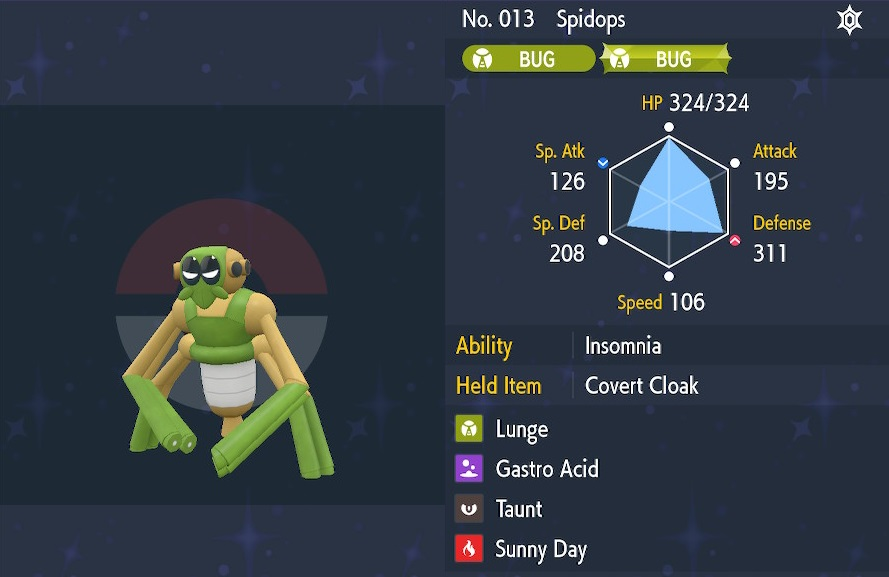

These are some of the pokemon builds I use for ★6\~7 Tera Raids. - ※ Last updated December 24th, 2022.

Stat abbreviations: Atk - Attack, Def - Defense, SpA - Sp. Atk, SpD - Sp. Def, Spe - Speed

# Online

## General (Random Players)

### Physical

<table class="buildsTable">
  <tr>
    <td rowspan="7" class="highlightNavy buildImage"></td>
    <td class="highlightGray">Name</td>
    <td>Umbreon</td>
    <td class="highlightGray">Notes</td>
  </tr>
  <tr>
    <td class="highlightGray">Item</td>
    <td>Light Clay / Wide Lens</td>
    <td rowspan="6">Taunt doesn't last long, and Screech doesn't work against a boss shield, so this build prefers a fast knockout.  If you need extended status protection or damage reduction beyond Reflect and cheers, use a different pokemon.</td>
  </tr>
  <tr>
    <td class="highlightGray">Tera</td>
    <td>Any</td>
  </tr>
  <tr>
    <td class="highlightGray">Ability</td>
    <td>Synchronize</td>
  </tr>
  <tr>
    <td class="highlightGray">Nature</td>
    <td>Bold (+Def, -Atk)</td>
  </tr>
  <tr>
    <td class="highlightGray">EVs</td>
    <td>252 HP, 252 Def, 4 Spe</td>
  </tr>
  <tr>
    <td class="highlightGray">Moves</td>
    <td>- Taunt - Screech / Fake Tears - Reflect - Helping Hand</td>
  </tr>
</table>

 

<table class="buildsTable">
  <tr>
    <td rowspan="7" class="highlightNavy buildImage"></td>
    <td class="highlightGray">Name</td>
    <td>Grimmsnarl</td>
    <td class="highlightGray">Notes</td>
  </tr>
  <tr>
    <td class="highlightGray">Item</td>
    <td>Light Clay</td>
    <td rowspan="6">Misty Terrain protects against status conditions for 5 turns.  Chilling Water lowers Atk by 1 stage even when the boss has a shield.  Taunt is mainly used against bosses that buff themselves or overwrite terrain, though there are better builds for bosses like Dragonite.</td>
  </tr>
  <tr>
    <td class="highlightGray">Tera</td>
    <td>Any</td>
  </tr>
  <tr>
    <td class="highlightGray">Ability</td>
    <td>Prankster</td>
  </tr>
  <tr>
    <td class="highlightGray">Nature</td>
    <td>Bold (+Def, -Atk)</td>
  </tr>
  <tr>
    <td class="highlightGray">EVs</td>
    <td>252 HP, 252 Def, 4 SpD</td>
  </tr>
  <tr>
    <td class="highlightGray">Moves</td>
    <td>- Chilling Water  - Reflect - Misty Terrain - Taunt</td>
  </tr>
</table>

 

<table class="buildsTable">
  <tr>
    <td rowspan="7" class="highlightNavy buildImage"></td>
    <td class="highlightGray">Name</td>
    <td>Corviknight</td>
    <td class="highlightGray">Notes</td>
  </tr>
  <tr>
    <td class="highlightGray">Item</td>
    <td>Wide Lens</td>
    <td rowspan="6">Taunt doesn't last long, and Screech doesn't work against a boss shield, so this build prefers a fast knockout.  If you need extended status protection or damage reduction beyond Reflect and cheers, use a different pokemon.  191 speed lets you outspeed neutral nature Baxcalibur to stop Snowscape.</td>
  </tr>
  <tr>
    <td class="highlightGray">Tera</td>
    <td>Any</td>
  </tr>
  <tr>
    <td class="highlightGray">Ability</td>
    <td>Mirror Armor (HA)</td>
  </tr>
  <tr>
    <td class="highlightGray">Nature</td>
    <td>Bold (+Def, -Atk)</td>
  </tr>
  <tr>
    <td class="highlightGray">EVs</td>
    <td>174 HP, 252 Def, 84 Spe</td>
  </tr>
  <tr>
    <td class="highlightGray">Moves</td>
    <td>- Taunt - Screech - Fake Tears - Reflect</td>
  </tr>
</table>

 

<table class="buildsTable">
  <tr>
    <td rowspan="7" class="highlightNavy buildImage"></td>
    <td class="highlightGray">Name</td>
    <td>Polteageist</td>
    <td class="highlightGray">Notes</td>
  </tr>
  <tr>
    <td class="highlightGray">Item</td>
    <td>Wide Lens / Ability Shield Kasib Berry</td>
    <td rowspan="6">Push Weak Armor on to the boss, then use Will-O-Wisp.  Strength Sap doesn't work when the boss has a shield up.  215 speed lets you outspeed +speed nature Annihilape.  Ability Shield ensures your ability doesn't reset to Weak Armor, but you might faint before it sees use.</td>
  </tr>
  <tr>
    <td class="highlightGray">Tera</td>
    <td>Any</td>
  </tr>
  <tr>
    <td class="highlightGray">Ability</td>
    <td>Weak Armor</td>
  </tr>
  <tr>
    <td class="highlightGray">Nature</td>
    <td>Timid (+Spe, -Atk)</td>
  </tr>
  <tr>
    <td class="highlightGray">EVs</td>
    <td>252 HP, 176 Def, 80 Spe</td>
  </tr>
  <tr>
    <td class="highlightGray">Moves</td>
    <td>- Skill Swap - Strength Sap / Reflect - Will-O-Wisp - Trick Room</td>
  </tr>
</table>

### Special

<table class="buildsTable">
  <tr>
    <td rowspan="7" class="highlightNavy buildImage"></td>
    <td class="highlightGray">Name</td>
    <td>Gardevoir</td>
    <td class="highlightGray">Notes</td>
  </tr>
  <tr>
    <td class="highlightGray">Item</td>
    <td>Light Clay</td>
    <td rowspan="6">Misty Terrain protects against status conditions for 5 turns.  Mystical Fire lowers SpA by 1 stage even when the boss has a shield.  Taunt is mainly used against bosses that buff themselves or overwrite terrain.  Particularly good against Gardevoir.</td>
  </tr>
  <tr>
    <td class="highlightGray">Tera</td>
    <td>Any</td>
  </tr>
  <tr>
    <td class="highlightGray">Ability</td>
    <td>Synchronize</td>
  </tr>
  <tr>
    <td class="highlightGray">Nature</td>
    <td>Calm (+SpD, -Atk)</td>
  </tr>
  <tr>
    <td class="highlightGray">EVs</td>
    <td>252 HP, 252 SpD, 4 Def</td>
  </tr>
  <tr>
    <td class="highlightGray">Moves</td>
    <td>- Mystical Fire  - Light Screen - Misty Terrain - Taunt</td>
  </tr>
</table>

 

<table class="buildsTable">
  <tr>
    <td rowspan="7" class="highlightNavy buildImage"></td>
    <td class="highlightGray">Name</td>
    <td>Grimmsnarl</td>
    <td class="highlightGray">Notes</td>
  </tr>
  <tr>
    <td class="highlightGray">Item</td>
    <td>Light Clay</td>
    <td rowspan="6">Misty Terrain protects against status conditions for 5 turns.  Spirit Break lowers SpA by 1 stage even when the boss has a shield.  Taunt is mainly used against bosses that buff themselves or overwrite terrain.  Basically the same as Gardevoir, but has a different defensive typing.</td>
  </tr>
  <tr>
    <td class="highlightGray">Tera</td>
    <td>Any</td>
  </tr>
  <tr>
    <td class="highlightGray">Ability</td>
    <td>Prankster</td>
  </tr>
  <tr>
    <td class="highlightGray">Nature</td>
    <td>Careful (+SpD, -SpA)</td>
  </tr>
  <tr>
    <td class="highlightGray">EVs</td>
    <td>252 HP, 252 SpD, 4 Def</td>
  </tr>
  <tr>
    <td class="highlightGray">Moves</td>
    <td>- Spirit Break  - Light Screen - Misty Terrain - Taunt</td>
  </tr>
</table>

 

<table class="buildsTable">
  <tr>
    <td rowspan="7" class="highlightNavy buildImage"></td>
    <td class="highlightGray">Name</td>
    <td>Blissey</td>
    <td class="highlightGray">Notes</td>
  </tr>
  <tr>
    <td class="highlightGray">Item</td>
    <td>Covert Cloak</td>
    <td rowspan="6">Electric Terrain activates Quark Drive and grants sleep immunity to party, but Skill Swap is another option for bosses like Kilowattrel.  Natural Cure is fine if you don't want to spend an Ability Patch.  151 speed lets you outspeed neutral nature Eeveelutions.</td>
  </tr>
  <tr>
    <td class="highlightGray">Tera</td>
    <td>Any</td>
  </tr>
  <tr>
    <td class="highlightGray">Ability</td>
    <td>Healer (HA)</td>
  </tr>
  <tr>
    <td class="highlightGray">Nature</td>
    <td>Calm (+SpD, -Atk)</td>
  </tr>
  <tr>
    <td class="highlightGray">EVs</td>
    <td>238 HP, 252 SpD, 20 Spe</td>
  </tr>
  <tr>
    <td class="highlightGray">Moves</td>
    <td>- Helping Hand - Heal Pulse / Life Dew - Light Screen - Electric Terrain</td>
  </tr>
</table>

## Boss-Specific

#### VS Annihilape

<table class="buildsTable">
  <tr>
    <td rowspan="7" class="highlightNavy buildImage"></td>
    <td class="highlightGray">Name</td>
    <td>Oranguru</td>
    <td class="highlightGray">Notes</td>
  </tr>
  <tr>
    <td class="highlightGray">Item</td>
    <td>Flame Orb</td>
    <td rowspan="6">Turn 1 - Select your move ASAP: If there are no debuff users, Taunt. If there are debuff users, Skill Swap.  Use Hang Tough! and Reflect to reduce damage, but critical hits ignore screens and stat modifiers.  Once Annihilape does the 2nd boss reset at 50% HP, use Fling to inflict burn.  Bad teammates can still mess up the raid even if you play your part well.</td>
  </tr>
  <tr>
    <td class="highlightGray">Tera</td>
    <td>Any</td>
  </tr>
  <tr>
    <td class="highlightGray">Ability</td>
    <td>Telepathy</td>
  </tr>
  <tr>
    <td class="highlightGray">Nature</td>
    <td>Bold (+Def, -Atk)</td>
  </tr>
  <tr>
    <td class="highlightGray">EVs</td>
    <td>98 HP, 252 Def, 160 Spe</td>
  </tr>
  <tr>
    <td class="highlightGray">Moves</td>
    <td>- Taunt - Reflect - Fling  - Skill Swap</td>
  </tr>
</table>

#### VS Dragonite

<table class="buildsTable">
  <tr>
    <td rowspan="7" class="highlightNavy buildImage"></td>
    <td class="highlightGray">Name</td>
    <td>Grimmsnarl</td>
    <td class="highlightGray">Notes</td>
  </tr>
  <tr>
    <td class="highlightGray">Item</td>
    <td>Flame Orb</td>
    <td rowspan="6">Turn 1 - Select Taunt ASAP to prevent Dragon Dance usage.  Use Hang Tough!, Chilling Water, and Reflect to reduce damage.  Once Dragonite does the 2nd boss reset at 50% HP, use Fling to inflict burn.</td>
  </tr>
  <tr>
    <td class="highlightGray">Tera</td>
    <td>Any</td>
  </tr>
  <tr>
    <td class="highlightGray">Ability</td>
    <td>Prankster</td>
  </tr>
  <tr>
    <td class="highlightGray">Nature</td>
    <td>Bold (+Def, -Atk)</td>
  </tr>
  <tr>
    <td class="highlightGray">EVs</td>
    <td>252 HP, 252 Def, 4 SpD</td>
  </tr>
  <tr>
    <td class="highlightGray">Moves</td>
    <td>- Chilling Water  - Reflect - Fling  - Taunt</td>
  </tr>
</table>

#### VS Corviknight

<table class="buildsTable">
  <tr>
    <td rowspan="7" class="highlightNavy buildImage"></td>
    <td class="highlightGray">Name</td>
    <td>Palossand</td>
    <td class="highlightGray">Notes</td>
  </tr>
  <tr>
    <td class="highlightGray">Item</td>
    <td>Covert Cloak</td>
    <td rowspan="6">Remove Mirror Armor with Skill Swap, then use Hang Tough! once, followed by repeated Chilling Water usage.  Rain Dance or Sunny Day is just in case an ally changes the weather to a sandstorm for whatever reason.  Not as good as Fling + Flame Orb Oranguru, but can be fun to use other pokemon sometimes.</td>
  </tr>
  <tr>
    <td class="highlightGray">Tera</td>
    <td>Any</td>
  </tr>
  <tr>
    <td class="highlightGray">Ability</td>
    <td>Sand Veil (HA)</td>
  </tr>
  <tr>
    <td class="highlightGray">Nature</td>
    <td>Bold (+Def, -Atk)</td>
  </tr>
  <tr>
    <td class="highlightGray">EVs</td>
    <td>252 HP, 252 Def, 4 SpD</td>
  </tr>
  <tr>
    <td class="highlightGray">Moves</td>
    <td>- Chilling Water  - Shore Up - Skill Swap - Rain Dance / Sunny Day</td>
  </tr>
</table>

#### VS Clodsire

<table class="buildsTable">
  <tr>
    <td rowspan="7" class="highlightNavy buildImage"></td>
    <td class="highlightGray">Name</td>
    <td>Spidops</td>
    <td class="highlightGray">Notes</td>
  </tr>
  <tr>
    <td class="highlightGray">Item</td>
    <td>Covert Cloak</td>
    <td rowspan="6">Gastro Acid erases the boss's ability which has a chance of being Unaware.  Taunt prevents Yawn usage for a bit, but otherwise use Hang Tough! and spam Lunge to reduce damage.  Sunny Day activates Protosynthesis if you have Scarlet paradox allies, and Covert Cloak protects you from poison.</td>
  </tr>
  <tr>
    <td class="highlightGray">Tera</td>
    <td>Any</td>
  </tr>
  <tr>
    <td class="highlightGray">Ability</td>
    <td>Insomnia</td>
  </tr>
  <tr>
    <td class="highlightGray">Nature</td>
    <td>Impish (+Def, -SpA)</td>
  </tr>
  <tr>
    <td class="highlightGray">EVs</td>
    <td>252 HP, 252 Def, 4 Atk</td>
  </tr>
  <tr>
    <td class="highlightGray">Moves</td>
    <td>- Lunge  - Gastro Acid - Taunt - Sunny Day</td>
  </tr>
</table>
