Non-Event 6 star tera raid boss data. (Source: <a href="https://stevecooktu.github.io/sv_raid_lookup/">SV Raid Lookup</a> and <a href="https://hyperwiki.jp/pokemonsv/raid-param/">hyperWiki</a>) Images are from Serebii.

All bosses:

- Boss Level: 90
- Time Limit: 7m 30s (450 sec)
- Stat values as of game version 1.10 - hyperWiki claims stats use 0 IV as a base, and some stats have 128 EVs.
- Shield damage rate is 20% from regular pokemon, or 75% from Terastallized pokemon.

 

<table class="raidTable">
  <tr>
    <td colspan="5" class="tableDivider"></td>
  </tr>
  <tr>
    <td class="centeredText highlightDarkGray">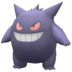</td>
    <td class="centeredText highlightDarkGray">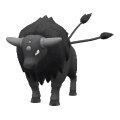</td>
    <td class="centeredText highlightDarkGray">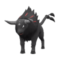</td>
    <td class="centeredText highlightDarkGray">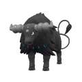</td>
    <td class="centeredText highlightDarkGray">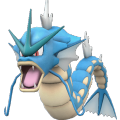</td>
  </tr>
  <tr>
    <td class="centeredText highlightGray">Gengar</td>
    <td class="centeredText highlightGray">Tauros</td>
    <td class="centeredText highlightGray">Tauros</td>
    <td class="centeredText highlightGray">Tauros</td>
    <td class="centeredText highlightGray">Gyarados</td>
  </tr>
  <tr>
    <td>Base Type: - Ghost / Poison</td>
    <td>Base Type: - Fighting</td>
    <td>Base Type: - Fighting / Fire</td>
    <td>Base Type: - Fighting / Water</td>
    <td>Base Type: - Water / Flying</td>
  </tr>
  <tr>
    <td>Base Stats: 60, 65, 60, 130, 75, 110</td>
    <td>Base Stats: 75, 110, 105, 30, 70, 100</td>
    <td>Base Stats: 75, 110, 105, 30, 70, 100</td>
    <td>Base Stats: 75, 110, 105, 30, 70, 100</td>
    <td>Base Stats: 95, 125, 79, 60, 100, 81</td>
  </tr>
  <tr>
    <td>Stats: - HP: 5200 - Atk: 122 - Def: 141 - Sp.Atk: 239 - Sp.Def: 140 - Speed: 207 - 231 - 254</td>
    <td>Stats: - HP: 5875 - Atk: 203 - Def: 222 - Sp.Atk: 59 - Sp.Def: 131 - Speed: 191 - 213 - 234</td>
    <td>Stats: - HP: 5875 - Atk: 203 - Def: 222 - Sp.Atk: 59 - Sp.Def: 131 - Speed: 191 - 213 - 234</td>
    <td>Stats: - HP: 5875 - Atk: 203 - Def: 222 - Sp.Atk: 59 - Sp.Def: 131 - Speed: 191 - 213 - 234</td>
    <td>Stats: - HP: 6775 - Atk: 230 - Def: 147 - Sp.Atk: 113 - Sp.Def: 185 - Speed: 161 - 179 - 196</td>
  </tr>
  <tr>
    <td>Ability: - Cursed Body</td>
    <td>Ability: - Cud Chew (HA)</td>
    <td>Ability: - Cud Chew (HA)</td>
    <td>Ability: - Cud Chew (HA)</td>
    <td>Ability: - Moxie (HA)</td>
  </tr>
  <tr>
    <td>Moves: - Shadow Ball  - Sludge Bomb  - Dazzling Gleam  - Will-O-Wisp</td>
    <td>Moves: - Close Combat  - Thrash  - Zen Headbutt  - Raging Bull </td>
    <td>Moves: - Flare Blitz  - Close Combat  - Flamethrower  - Headbutt </td>
    <td>Moves: - Wave Crash  - Close Combat  - Surf  - Headbutt </td>
    <td>Moves: - Aqua Tail  - Crunch  - Hurricane  - Ice Fang </td>
  </tr>
  <tr>
    <td>Actions: - Hypnosis: 67 sec - Tera Reset: 75% HP - Boss Reset: 50% HP - Player Reset: 45% HP - Hypnosis: 25% HP</td>
    <td>Actions: - Boss Reset: 22 sec - Bulk Up: 90% HP - Boss Reset: 50% HP - Player Reset: 180 sec - Screech: 25% HP</td>
    <td>Actions: - Sunny Day: 90% HP - Tera Reset: 135 sec - Boss Reset: 50% HP - Player Reset: 180 sec - Bulk Up: 35% HP - Sunny Day: 20% HP</td>
    <td>Actions: - Rain Dance: 90% HP - Tera Reset: 135 sec - Boss Reset: 50% HP - Player Reset: 180 sec - Bulk Up: 35% HP - Rain Dance: 20% HP</td>
    <td>Actions: - Boss Reset: 90% HP - Tera Reset: 135 sec - Boss Reset: 50% HP - Player Reset: 180 sec - Taunt: 40% HP - Dragon Dance: 20% HP</td>
  </tr>
  <tr>
    <td>Shield Trigger: - 60% HP or 202 sec</td>
    <td>Shield Trigger: - 60% HP or 202 sec</td>
    <td>Shield Trigger: - 60% HP or 202 sec</td>
    <td>Shield Trigger: - 60% HP or 202 sec</td>
    <td>Shield Trigger: - 50% HP or 202 sec</td>
  </tr>
  <tr>
    <td>Shield HP: 30%</td>
    <td>Shield HP: 30%</td>
    <td>Shield HP: 30%</td>
    <td>Shield HP: 30%</td>
    <td>Shield HP: 35%</td>
  </tr>
  <tr>
    <td>Herba Mystica: - Bitter (3.03%)</td>
    <td>Herba Mystica: - Spicy (3.05%)</td>
    <td>Herba Mystica: - Spicy (3.05%)</td>
    <td>Herba Mystica: - Spicy (3.05%)</td>
    <td>Herba Mystica: - Spicy (3.05%)</td>
  </tr>
  <tr>
    <td colspan="5" class="tableDivider"></td>
  </tr>
  <tr>
    <td class="centeredText highlightDarkGray"></td>
    <td class="centeredText highlightDarkGray">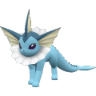</td>
    <td class="centeredText highlightDarkGray">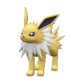</td>
    <td class="centeredText highlightDarkGray">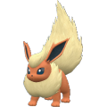</td>
    <td class="centeredText highlightDarkGray">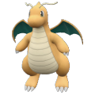</td>
  </tr>
  <tr>
    <td class="centeredText highlightGray">Ditto</td>
    <td class="centeredText highlightGray">Vaporeon</td>
    <td class="centeredText highlightGray">Jolteon</td>
    <td class="centeredText highlightGray">Flareon</td>
    <td class="centeredText highlightGray">Dragonite</td>
  </tr>
  <tr>
    <td>Base Type: - Normal</td>
    <td>Base Type: - Water</td>
    <td>Base Type: - Electric</td>
    <td>Base Type: - Fire</td>
    <td>Base Type: - Dragon / Flying</td>
  </tr>
  <tr>
    <td>Base Stats: 48, 48, 48, 48, 48, 48</td>
    <td>Base Stats: 130, 65, 60, 110, 95, 65</td>
    <td>Base Stats: 65, 65, 60, 110, 95, 130</td>
    <td>Base Stats: 65, 130, 60, 95, 110, 65</td>
    <td>Base Stats: 91, 134, 95, 100, 100, 80</td>
  </tr>
  <tr>
    <td>Stats: - HP: 4650 - Atk: 91 - Def: 120 - Sp.Atk: 91 - Sp.Def: 91 - Speed: 108 - 120 - 132</td>
    <td>Stats: - HP: 8350 - Atk: 122 - Def: 113 - Sp.Atk: 203 - Sp.Def: 176 - Speed: 135 - 150 - 165</td>
    <td>Stats: - HP: 5425 - Atk: 122 - Def: 113 - Sp.Atk: 203 - Sp.Def: 176 - Speed: 240 - 267 - 293</td>
    <td>Stats: - HP: 5425 - Atk: 239 - Def: 113 - Sp.Atk: 176 - Sp.Def: 203 - Speed: 135 - 150 - 165</td>
    <td>Stats: - HP: 6575 - Atk: 246 - Def: 176 - Sp.Atk: 185 - Sp.Def: 185 - Speed: 159 - 177 - 194</td>
  </tr>
  <tr>
    <td>Ability: - Imposter (HA)</td>
    <td>Ability: - Hydration (HA)</td>
    <td>Ability: - Quick Feet (HA)</td>
    <td>Ability: - Guts (HA)</td>
    <td>Ability: - Multiscale (HA)</td>
  </tr>
  <tr>
    <td>Moves: - Transform</td>
    <td>Moves: - Tera Blast - Surf  - Hyper Voice  - Yawn</td>
    <td>Moves: - Tera Blast - Thunderbolt  - Shadow Ball  - Thunder Wave</td>
    <td>Moves: - Tera Blast - Flare Blitz  - Lava Plume  - Will-O-Wisp</td>
    <td>Moves: - Dragon Rush  - Extreme Speed  - Dragon Dance - Aqua Tail </td>
  </tr>
  <tr>
    <td>Actions: - Boss Reset: 50% HP - Player Reset: 180 sec</td>
    <td>Actions: - Rain Dance: 90% HP - Tera Reset: 135 sec - Boss Reset: 50% - Player Reset: 180 sec - Calm Mind: 35% HP - Rain Dance: 20% HP</td>
    <td>Actions: - Electric Terrain: 90% HP - Tera Reset: 135 sec - Boss Reset: 50% - Player Reset: 180 sec - Calm Mind: 35% HP - Electric Terrain: 20% HP</td>
    <td>Actions: - Sunny Day: 90% HP - Tera Reset: 135 sec - Boss Reset: 50% - Player Reset: 180 sec - Curse: 35% HP - Sunny Day: 20% HP</td>
    <td>Actions: - Boss Reset: 95% HP - Tera Reset: 135 sec - Boss Reset: 50% HP - Light Screen: 157 sec - Player Reset: 225 sec - Dragon Dance: 30% HP</td>
  </tr>
  <tr>
    <td>Shield Trigger: - 60% HP or 202 sec</td>
    <td>Shield Trigger: - 50% HP or 202 sec</td>
    <td>Shield Trigger: - 50% HP or 202 sec</td>
    <td>Shield Trigger: - 50% HP or 202 sec</td>
    <td>Shield Trigger: - 50% HP or 202 sec</td>
  </tr>
  <tr>
    <td>Shield HP: 30%</td>
    <td>Shield HP: 35%</td>
    <td>Shield HP: 25%</td>
    <td>Shield HP: 25%</td>
    <td>Shield HP: 35%</td>
  </tr>
  <tr>
    <td>Herba Mystica: - Sweet (3.03%)</td>
    <td>Herba Mystica: - Spicy (3.03%) - Sweet (3.03%) - Salty (3.03%) - Bitter (3.03%) - Sour (3.03%)</td>
    <td>Herba Mystica: - Sweet (3.03%)</td>
    <td>Herba Mystica: - Spicy (3.05%)</td>
    <td>Herba Mystica: - Spicy (3.05%)</td>
  </tr>
  <tr>
    <td colspan="5" class="tableDivider"></td>
  </tr>
  <tr>
    <td class="centeredText highlightDarkGray">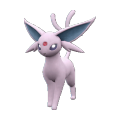</td>
    <td class="centeredText highlightDarkGray">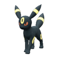</td>
    <td class="centeredText highlightDarkGray"></td>
    <td class="centeredText highlightDarkGray">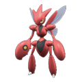</td>
    <td class="centeredText highlightDarkGray">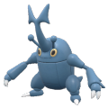</td>
  </tr>
  <tr>
    <td class="centeredText highlightGray">Espeon</td>
    <td class="centeredText highlightGray">Umbreon</td>
    <td class="centeredText highlightGray">Slowking</td>
    <td class="centeredText highlightGray">Scizor</td>
    <td class="centeredText highlightGray">Heracross</td>
  </tr>
  <tr>
    <td>Base Type: - Psychic</td>
    <td>Base Type: - Dark</td>
    <td>Base Type: - Water / Psychic</td>
    <td>Base Type: - Bug / Steel</td>
    <td>Base Type: - Bug / Fighting</td>
  </tr>
  <tr>
    <td>Base Stats: 65, 65, 60, 130, 95, 110</td>
    <td>Base Stats: 95, 65, 110, 60, 130, 65</td>
    <td>Base Stats: 95, 75, 80, 100, 110, 30</td>
    <td>Base Stats: 70, 130, 100, 55, 80, 65</td>
    <td>Base Stats: 80, 125, 75, 40, 95, 85</td>
  </tr>
  <tr>
    <td>Stats: - HP: 5425 - Atk: 122 - Def: 113 - Sp.Atk: 239 - Sp.Def: 176 - Speed: 207 - 231 - 254</td>
    <td>Stats: - HP: 6775 - Atk: 122 - Def: 203 - Sp.Atk: 113 - Sp.Def: 239 - Speed: 135 - 150 - 165</td>
    <td>Stats: - HP: 6775 - Atk: 140 - Def: 149 - Sp.Atk: 185 - Sp.Def: 203 - Speed: 78 - 87 - 95</td>
    <td>Stats: - HP: 5650 - Atk: 239 - Def: 213 - Sp.Atk: 104 - Sp.Def: 149 - Speed: 135 - 150 - 165</td>
    <td>Stats: - HP: 6100 - Atk: 230 - Def: 168 - Sp.Atk: 77 - Sp.Def: 176 - Speed: 167 - 186 - 204</td>
  </tr>
  <tr>
    <td>Ability: - Magic Bounce (HA)</td>
    <td>Ability: - Inner Focus (HA)</td>
    <td>Ability: - Regenerator (HA)</td>
    <td>Ability: - Light Metal (HA)</td>
    <td>Ability: - Moxie (HA)</td>
  </tr>
  <tr>
    <td>Moves: - Tera Blast - Psychic  - Psyshock  - Tickle</td>
    <td>Moves: - Tera Blast - Dark Pulse  - Foul Play  - Tickle</td>
    <td>Moves: - Surf  - Psyshock  - Trick Room - Flamethrower </td>
    <td>Moves: - X-Scissor  - Bullet Punch  - Close Combat  - Iron Head </td>
    <td>Moves: - Megahorn  - Close Combat  - Thrash  - Leer</td>
  </tr>
  <tr>
    <td>Actions: - Psychic Terrain: 90% HP - Tera Reset: 135 sec - Boss Reset: 50% - Player Reset: 180 sec - Calm Mind: 35% HP - Psychic Terrain: 20% HP</td>
    <td>Actions: - Calm Mind: 90% HP - Tera Reset: 135 sec - Boss Reset: 50% - Player Reset: 180 sec - Curse: 35% HP - Calm Mind: 20% HP</td>
    <td>Actions: - Light Screen: 135 sec - Rain Dance: 90% HP - Boss Reset: 50% HP - Player Reset: 180 sec - Calm Mind: 35% HP - Trick Room: 20% HP</td>
    <td>Actions: - Iron Defense: 67 sec - Focus Energy: 75% HP - Boss Reset: 50% HP - Player Reset: 180 sec</td>
    <td>Actions: - Bulk Up: 75% HP - Boss Reset: 50% HP - Player Reset: 180 sec - Focus Energy: 20% HP</td>
  </tr>
  <tr>
    <td>Shield Trigger: - 50% HP or 202 sec</td>
    <td>Shield Trigger: - 50% HP or 202 sec</td>
    <td>Shield Trigger: - 65% HP or 202 sec</td>
    <td>Shield Trigger: - 60% HP or 202 sec</td>
    <td>Shield Trigger: - 65% HP or 202 sec</td>
  </tr>
  <tr>
    <td>Shield HP: 25%</td>
    <td>Shield HP: 35%</td>
    <td>Shield HP: 35%</td>
    <td>Shield HP: 30%</td>
    <td>Shield HP: 30%</td>
  </tr>
  <tr>
    <td>Herba Mystica: - Bitter (3.03%)</td>
    <td>Herba Mystica: - Sour (3.03%)</td>
    <td>Herba Mystica: - Sour (3.03%)</td>
    <td>Herba Mystica: - Spicy (3.05%)</td>
    <td>Herba Mystica: - Spicy (3.05%)</td>
  </tr>
  <tr>
    <td colspan="5" class="tableDivider"></td>
  </tr>
  <tr>
    <td class="centeredText highlightDarkGray"></td>
    <td class="centeredText highlightDarkGray">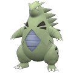</td>
    <td class="centeredText highlightDarkGray">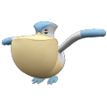</td>
    <td class="centeredText highlightDarkGray">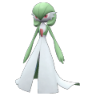</td>
    <td class="centeredText highlightDarkGray">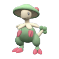</td>
  </tr>
  <tr>
    <td class="centeredText highlightGray">Blissey</td>
    <td class="centeredText highlightGray">Tyranitar</td>
    <td class="centeredText highlightGray">Pelipper</td>
    <td class="centeredText highlightGray">Gardevoir</td>
    <td class="centeredText highlightGray">Breloom</td>
  </tr>
  <tr>
    <td>Base Type: - Normal</td>
    <td>Base Type: - Rock / Dark</td>
    <td>Base Type: - Water / Flying</td>
    <td>Base Type: - Psychic / Fairy</td>
    <td>Base Type: - Grass / Fighting</td>
  </tr>
  <tr>
    <td>Base Stats: 255, 10, 10, 75, 135, 55</td>
    <td>Base Stats: 100, 134, 110, 95, 100, 61</td>
    <td>Base Stats: 60, 50, 100, 95, 70, 65</td>
    <td>Base Stats: 68, 65, 65, 125, 115, 80</td>
    <td>Base Stats: 60, 130, 80, 60, 60, 70</td>
  </tr>
  <tr>
    <td>Stats: - HP: 13975 - Atk: 23 - Def: 23 - Sp.Atk: 140 - Sp.Def: 248 - Speed: 118 - 132 - 145</td>
    <td>Stats: - HP: 7000 - Atk: 246 - Def: 203 - Sp.Atk: 176 - Sp.Def: 185 - Speed: 128 - 143 - 157</td>
    <td>Stats: - HP: 5200 - Atk: 95 - Def: 185 - Sp.Atk: 176 - Sp.Def: 131 - Speed: 135 - 150 - 165</td>
    <td>Stats: - HP: 5550 - Atk: 122 - Def: 150 - Sp.Atk: 230 - Sp.Def: 212 - Speed: 159 - 177 - 194</td>
    <td>Stats: - HP: 5200 - Atk: 239 - Def: 177 - Sp.Atk: 113 - Sp.Def: 113 - Speed: 143 - 159 - 174</td>
  </tr>
  <tr>
    <td>Ability: - Healer (HA)</td>
    <td>Ability: - Unnerve (HA)</td>
    <td>Ability: - Drizzle</td>
    <td>Ability: - Synchronize - Trace - Telepathy (HA)</td>
    <td>Ability: - Technician (HA)</td>
  </tr>
  <tr>
    <td>Moves: - Dazzling Gleam  - Hyper Voice  - Sing - Light Screen</td>
    <td>Moves: - Stone Edge  - Crunch  - Screech - Rock Blast </td>
    <td>Moves: - Hurricane  - Hydro Pump  - Mist - Supersonic</td>
    <td>Moves: - Moonblast  - Psychic  - Calm Mind - Thunder Wave</td>
    <td>Moves: - Bullet Seed  - Low Sweep  - Spore - Aerial Ace </td>
  </tr>
  <tr>
    <td>Actions: - Defense Curl: 95% HP - Defense Curl: 75% HP - Boss Reset: 50% HP - Player Reset: 180 sec - Sing: 30% HP - Boss Reset: 30% HP</td>
    <td>Actions: - Boss Reset: 90% HP - Tera Reset: 112 sec - Boss Reset: 50% HP - Player Reset: 180 sec - Crunch: 30% HP - Iron Defense: 20% HP</td>
    <td>Actions: - Rain Dance: 90% HP - Tera Reset: 112 sec - Boss Reset: 50% HP - Player Reset: 180 sec - Agility: 30% HP - Rain Dance: 20% HP</td>
    <td>Actions: - Misty Terrain: 67 sec - Calm Mind: 75% HP - Boss Reset: 50% HP - Player Reset: 45% HP - Psychic Terrain: 35% HP</td>
    <td>Actions: - Grassy Terrain: 90 sec - Spore: 75% HP - Boss Reset: 50% HP - Tera Reset: 45% HP - Player Reset: 20% HP</td>
  </tr>
  <tr>
    <td>Shield Trigger: - 75% HP or 202 sec</td>
    <td>Shield Trigger: - 50% HP or 202 sec</td>
    <td>Shield Trigger: - 50% HP or 202 sec</td>
    <td>Shield Trigger: - 60% HP or 202 sec</td>
    <td>Shield Trigger: - 60% HP or 202 sec</td>
  </tr>
  <tr>
    <td>Shield HP: 40%</td>
    <td>Shield HP: 35%</td>
    <td>Shield HP: 35%</td>
    <td>Shield HP: 30%</td>
    <td>Shield HP: 30%</td>
  </tr>
  <tr>
    <td>Herba Mystica: - Spicy (3.03%) - Sweet (3.03%) - Salty (3.03%) - Bitter (3.03%) - Sour (3.03%)</td>
    <td>Herba Mystica: - Spicy (3.05%)</td>
    <td>Herba Mystica: - Salty (3.03%)</td>
    <td>Herba Mystica: - Bitter (3.03%)</td>
    <td>Herba Mystica: - Spicy (3.05%)</td>
  </tr>
  <tr>
    <td colspan="5" class="tableDivider"></td>
  </tr>
  <tr>
    <td class="centeredText highlightDarkGray">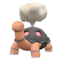</td>
    <td class="centeredText highlightDarkGray">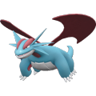</td>
    <td class="centeredText highlightDarkGray">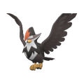</td>
    <td class="centeredText highlightDarkGray">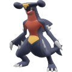</td>
    <td class="centeredText highlightDarkGray">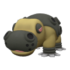</td>
  </tr>
  <tr>
    <td class="centeredText highlightGray">Torkoal</td>
    <td class="centeredText highlightGray">Salamence</td>
    <td class="centeredText highlightGray">Staraptor</td>
    <td class="centeredText highlightGray">Garchomp</td>
    <td class="centeredText highlightGray">Hippowdon</td>
  </tr>
  <tr>
    <td>Base Type: - Fire</td>
    <td>Base Type: - Dragon / Flying</td>
    <td>Base Type: - Normal / Flying</td>
    <td>Base Type: - Dragon / Ground</td>
    <td>Base Type: - Ground</td>
  </tr>
  <tr>
    <td>Base Stats: 70, 85, 140, 85, 70, 20</td>
    <td>Base Stats: 95, 135, 80, 110, 80, 100</td>
    <td>Base Stats: 85, 120, 70, 50, 60, 100</td>
    <td>Base Stats: 108, 130, 95, 80, 85, 102</td>
    <td>Base Stats: 108, 112, 118, 68, 72, 47</td>
  </tr>
  <tr>
    <td>Stats: - HP: 5650 - Atk: 158 - Def: 257 - Sp.Atk: 158 - Sp.Def: 131 - Speed: 62 - 69 - 75</td>
    <td>Stats: - HP: 6775 - Atk: 248 - Def: 149 - Sp.Atk: 203 - Sp.Def: 149 - Speed: 191 - 213 - 234</td>
    <td>Stats: - HP: 6325 - Atk: 221 - Def: 159 - Sp.Atk: 95 - Sp.Def: 113 - Speed: 191 - 213 - 234</td>
    <td>Stats: - HP: 7350 - Atk: 239 - Def: 176 - Sp.Atk: 149 - Sp.Def: 158 - Speed: 195 - 217 - 238</td>
    <td>Stats: - HP: 7350 - Atk: 206 - Def: 246 - Sp.Atk: 127 - Sp.Def: 134 - Speed: 106 - 118 - 129</td>
  </tr>
  <tr>
    <td>Ability: - Drought</td>
    <td>Ability: - Moxie (HA)</td>
    <td>Ability: - Reckless (HA)</td>
    <td>Ability: - Rough Skin (HA)</td>
    <td>Ability: - Sand Force (HA)</td>
  </tr>
  <tr>
    <td>Moves: - Lava Plume  - Yawn - Clear Smog  - Body Slam </td>
    <td>Moves: - Outrage  - Dual Wingbeat  - Flamethrower  - Tera Blast</td>
    <td>Moves: - Close Combat  - Brave Bird  - Double-Edge  - Feather Dance</td>
    <td>Moves: - Outrage  - Earthquake  - Flamethrower  - Rock Slide </td>
    <td>Moves: - Earthquake  - Ice Fang  - Yawn - Rock Slide </td>
  </tr>
  <tr>
    <td>Actions: - Sunny Day: 90% HP - Tera Reset: 112 sec - Boss Reset: 50% HP - Player Reset: 180 sec - Yawn: 30% HP - Iron Defense: 20% HP</td>
    <td>Actions: - Boss Reset: 90% HP - Tera Reset: 112 sec - Boss Reset: 50% HP - Player Reset: 180 sec - Dragon Dance: 30% HP - Boss Reset: 30% HP</td>
    <td>Actions: - Boss Reset: 67 sec - Player Reset: 75% HP - Boss Reset: 50% HP - Player Reset: 50% HP - Brave Bird: 25% HP</td>
    <td>Actions: - Boss Reset: 90% HP - Tera Reset: 112 sec - Boss Reset: 50% HP - Player Reset: 180 sec - Swords Dance: 30% HP - Player Reset: 30% HP</td>
    <td>Actions: - Yawn: 45 sec - Tera Reset: 60% HP - Boss Reset: 50% HP - Player Reset: 180 sec - Yawn: 20% HP</td>
  </tr>
  <tr>
    <td>Shield Trigger: - 60% HP or 202 sec</td>
    <td>Shield Trigger: - 50% HP or 202 sec</td>
    <td>Shield Trigger: - 60% HP or 202 sec</td>
    <td>Shield Trigger: - 50% HP or 202 sec</td>
    <td>Shield Trigger: - 65% HP or 202 sec</td>
  </tr>
  <tr>
    <td>Shield HP: 40%</td>
    <td>Shield HP: 30%</td>
    <td>Shield HP: 30%</td>
    <td>Shield HP: 30%</td>
    <td>Shield HP: 35%</td>
  </tr>
  <tr>
    <td>Herba Mystica: - Salty (3.03%)</td>
    <td>Herba Mystica: - Spicy (3.05%)</td>
    <td>Herba Mystica: - Spicy (3.05%)</td>
    <td>Herba Mystica: - Spicy (3.05%)</td>
    <td>Herba Mystica: - Salty (3.03%)</td>
  </tr>
  <tr>
    <td colspan="5" class="tableDivider"></td>
  </tr>
  <tr>
    <td class="centeredText highlightDarkGray"></td>
    <td class="centeredText highlightDarkGray">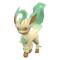</td>
    <td class="centeredText highlightDarkGray">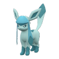</td>
    <td class="centeredText highlightDarkGray">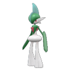</td>
    <td class="centeredText highlightDarkGray"></td>
  </tr>
  <tr>
    <td class="centeredText highlightGray">Magnezone</td>
    <td class="centeredText highlightGray">Leafeon</td>
    <td class="centeredText highlightGray">Glaceon</td>
    <td class="centeredText highlightGray">Gallade</td>
    <td class="centeredText highlightGray">Amoonguss</td>
  </tr>
  <tr>
    <td>Base Type: - Electric / Steel</td>
    <td>Base Type: - Grass</td>
    <td>Base Type: - Ice</td>
    <td>Base Type: - Psychic / Fighting</td>
    <td>Base Type: - Grass / Poison</td>
  </tr>
  <tr>
    <td>Base Stats: 70, 70, 115, 130, 90, 60</td>
    <td>Base Stats: 65, 110, 130, 60, 65, 95</td>
    <td>Base Stats: 65, 60, 110, 130, 95, 65</td>
    <td>Base Stats: 68, 125, 65, 65, 115, 80</td>
    <td>Base Stats: 114, 85, 70, 85, 80, 30</td>
  </tr>
  <tr>
    <td>Stats: - HP: 5650 - Atk: 131 - Def: 212 - Sp.Atk: 239 - Sp.Def: 167 - Speed: 126 - 141 - 155</td>
    <td>Stats: - HP: 5425 - Atk: 203 - Def: 239 - Sp.Atk: 113 - Sp.Def: 122 - Speed: 183 - 204 - 224</td>
    <td>Stats: - HP: 5425 - Atk: 113 - Def: 203 - Sp.Atk: 239 - Sp.Def: 176 - Speed: 135 - 150 - 165</td>
    <td>Stats: - HP: 5550 - Atk: 230 - Def: 150 - Sp.Atk: 122 - Sp.Def: 212 - Speed: 159 - 177 - 194</td>
    <td>Stats: - HP: 7625 - Atk: 158 - Def: 159 - Sp.Atk: 158 - Sp.Def: 149 - Speed: 78 - 87 - 95</td>
  </tr>
  <tr>
    <td>Ability: - Analytic (HA)</td>
    <td>Ability: - Chlorophyll (HA)</td>
    <td>Ability: - Ice Body (HA)</td>
    <td>Ability: - Steadfast - Sharpness - Justified (HA)</td>
    <td>Ability: - Regenerator (HA)</td>
  </tr>
  <tr>
    <td>Moves: - Thunder  - Flash Cannon  - Tri Attack  - Thunder Wave</td>
    <td>Moves: - Tera Blast - Leaf Blade  - Double Kick  - Charm</td>
    <td>Moves: - Tera Blast - Ice Beam  - Blizzard  - Charm</td>
    <td>Moves: - Psycho Cut  - Close Combat  - Will-O-Wisp - Aerial Ace </td>
    <td>Moves: - Energy Ball  - Foul Play  - Spore - Sludge Bomb </td>
  </tr>
  <tr>
    <td>Actions: - Rain Dance: 80% HP - Iron Defense: 112 sec - Boss Reset: 50% HP - Player Reset: 180 sec - Thunder Wave: 30% HP - Electric Terrain: 360 sec</td>
    <td>Actions: - Sunny Day: 90% HP - Tera Reset: 135 sec - Boss Reset: 50% HP - Player Reset: 180 sec - Swords Dance: 35% HP - Swords Dance: 20% HP</td>
    <td>Actions: - Snowscape: 90% HP - Tera Reset: 135 sec - Boss Reset: 50% HP - Player Reset: 180 sec - Calm Mind: 35% HP - Snowscape: 20% HP</td>
    <td>Actions: - Hypnosis: 67 sec - Disable: 75% HP - Boss Reset: 50% HP - Tera Reset: 50% HP - Psychic Terrain: 25% HP</td>
    <td>Actions: - Grassy Terrain: 45 sec - Tera Reset: 135 sec - Boss Reset: 50% HP - Player Reset: 180 sec - Grassy Terrain: 20% HP</td>
  </tr>
  <tr>
    <td>Shield Trigger: - 55% HP or 202 sec</td>
    <td>Shield Trigger: - 50% HP or 202 sec</td>
    <td>Shield Trigger: - 50% HP or 202 sec</td>
    <td>Shield Trigger: - 60% HP or 202 sec</td>
    <td>Shield Trigger: - 65% HP or 202 sec</td>
  </tr>
  <tr>
    <td>Shield HP: 30%</td>
    <td>Shield HP: 30%</td>
    <td>Shield HP: 25%</td>
    <td>Shield HP: 30%</td>
    <td>Shield HP: 35%</td>
  </tr>
  <tr>
    <td>Herba Mystica: - Bitter (3.03%)</td>
    <td>Herba Mystica: - Spicy (3.05%)</td>
    <td>Herba Mystica: - Bitter (3.03%)</td>
    <td>Herba Mystica: - Spicy (3.05%)</td>
    <td>Herba Mystica: - Spicy (3.03%) - Sweet (3.03%) - Salty (3.03%) - Bitter (3.03%) - Sour (3.03%)</td>
  </tr>
  <tr>
    <td colspan="5" class="tableDivider"></td>
  </tr>
  <tr>
    <td class="centeredText highlightDarkGray">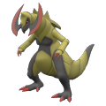</td>
    <td class="centeredText highlightDarkGray">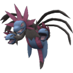</td>
    <td class="centeredText highlightDarkGray">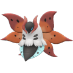</td>
    <td class="centeredText highlightDarkGray">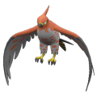</td>
    <td class="centeredText highlightDarkGray">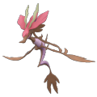</td>
  </tr>
  <tr>
    <td class="centeredText highlightGray">Haxorus</td>
    <td class="centeredText highlightGray">Hydreigon</td>
    <td class="centeredText highlightGray">Volcarona</td>
    <td class="centeredText highlightGray">Talonflame</td>
    <td class="centeredText highlightGray">Dragalge</td>
  </tr>
  <tr>
    <td>Base Type: - Dragon</td>
    <td>Base Type: - Dark / Dragon</td>
    <td>Base Type: - Bug / Fire</td>
    <td>Base Type: - Fire / Flying</td>
    <td>Base Type: - Poison / Dragon</td>
  </tr>
  <tr>
    <td>Base Stats: 76, 147, 90, 60, 70, 97</td>
    <td>Base Stats: 92, 105, 90, 125, 90, 98</td>
    <td>Base Stats: 85, 60, 65, 135, 105, 100</td>
    <td>Base Stats: 78, 81, 71, 74, 69, 126</td>
    <td>Base Stats: 65, 75, 90, 97, 123, 44</td>
  </tr>
  <tr>
    <td>Stats: - HP: 5900 - Atk: 269 - Def: 195 - Sp.Atk: 113 - Sp.Def: 131 - Speed: 187 - 208 - 228</td>
    <td>Stats: - HP: 6625 - Atk: 194 - Def: 195 - Sp.Atk: 230 - Sp.Def: 167 - Speed: 189 - 210 - 231</td>
    <td>Stats: - HP: 6325 - Atk: 113 - Def: 150 - Sp.Atk: 248 - Sp.Def: 194 - Speed: 191 - 213 - 234</td>
    <td>Stats: - HP: 6000 - Atk: 150 - Def: 161 - Sp.Atk: 138 - Sp.Def: 129 - Speed: 234 - 260 - 286</td>
    <td>Stats: - HP: 5425 - Atk: 140 - Def: 195 - Sp.Atk: 179 - Sp.Def: 226 - Speed: 101 - 113 - 124</td>
  </tr>
  <tr>
    <td>Ability: - Unnerve (HA)</td>
    <td>Ability: - Levitate</td>
    <td>Ability: - Swarm (HA)</td>
    <td>Ability: - Gale Wings (HA)</td>
    <td>Ability: - Adaptability (HA)</td>
  </tr>
  <tr>
    <td>Moves: - Outrage  - Crunch  - Giga Impact  - First Impression </td>
    <td>Moves: - Dark Pulse  - Dragon Pulse  - Crunch  - Taunt</td>
    <td>Moves: - Bug Buzz  - Flamethrower  - Hurricane  - Tailwind</td>
    <td>Moves: - Brave Bird  - Flare Blitz  - Flamethrower  - Tera Blast</td>
    <td>Moves: - Dragon Pulse  - Sludge Bomb  - Water Pulse  - Toxic</td>
  </tr>
  <tr>
    <td>Actions: - Boss Reset: 45 sec - Tera Reset: 135 sec - Boss Reset: 50% HP - Player Reset: 180 sec - Dragon Dance: 30% HP</td>
    <td>Actions: - Taunt: 85% HP - Work Up: 112 sec - Boss Reset: 50% HP - Player Reset: 180 sec - Boss Reset: 25% HP - Nasty Plot: 360 sec</td>
    <td>Actions: - Amnesia: 85% HP - Sunny Day: 75% HP - Boss Reset: 50% HP - Player Reset: 180 sec - Light Screen: 30% HP - Quiver Dance: 360 sec</td>
    <td>Actions: - Sunny Day: 90% HP - Tera Reset: 135 sec - Boss Reset: 50% HP - Player Reset: 180 sec - Swords Dance: 20% HP</td>
    <td>Actions: - Acid Spray: 67 sec - Draco Meteor: 75% HP - Boss Reset: 50% HP - Tera Reset: 45% HP - Draco Meteor: 30% HP</td>
  </tr>
  <tr>
    <td>Shield Trigger: - 60% HP or 202 sec</td>
    <td>Shield Trigger: - 55% HP or 202 sec</td>
    <td>Shield Trigger: - 50% HP or 202 sec</td>
    <td>Shield Trigger: - 60% HP or 202 sec</td>
    <td>Shield Trigger: - 60% HP or 202 sec</td>
  </tr>
  <tr>
    <td>Shield HP: 30%</td>
    <td>Shield HP: 30%</td>
    <td>Shield HP: 25%</td>
    <td>Shield HP: 25%</td>
    <td>Shield HP: 30%</td>
  </tr>
  <tr>
    <td>Herba Mystica: - Spicy (3.05%)</td>
    <td>Herba Mystica: - Bitter (3.03%)</td>
    <td>Herba Mystica: - Bitter (3.03%)</td>
    <td>Herba Mystica: - Sweet (3.03%)</td>
    <td>Herba Mystica: - Bitter (3.03%)</td>
  </tr>
  <tr>
    <td colspan="5" class="tableDivider"></td>
  </tr>
  <tr>
    <td class="centeredText highlightDarkGray">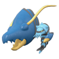</td>
    <td class="centeredText highlightDarkGray">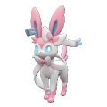</td>
    <td class="centeredText highlightDarkGray">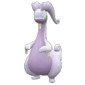</td>
    <td class="centeredText highlightDarkGray">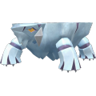</td>
    <td class="centeredText highlightDarkGray">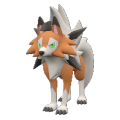</td>
  </tr>
  <tr>
    <td class="centeredText highlightGray">Clawitzer</td>
    <td class="centeredText highlightGray">Sylveon</td>
    <td class="centeredText highlightGray">Goodra</td>
    <td class="centeredText highlightGray">Avalugg</td>
    <td class="centeredText highlightGray">Lycanroc</td>
  </tr>
  <tr>
    <td>Base Type: - Water</td>
    <td>Base Type: - Fairy</td>
    <td>Base Type: - Dragon</td>
    <td>Base Type: - Ice</td>
    <td>Base Type: - Rock</td>
  </tr>
  <tr>
    <td>Base Stats: 71, 73, 88, 120, 89, 59</td>
    <td>Base Stats: 95, 65, 65, 110, 130, 60</td>
    <td>Base Stats: 90, 100, 70, 110, 150, 80</td>
    <td>Base Stats: 95, 117, 184, 44, 46, 28</td>
    <td>Base Stats: 75, 117, 65, 55, 65, 110</td>
  </tr>
  <tr>
    <td>Stats: - HP: 5675 - Atk: 136 - Def: 192 - Sp.Atk: 221 - Sp.Def: 165 - Speed: 126 - 140 - 154</td>
    <td>Stats: - HP: 6775 - Atk: 122 - Def: 122 - Sp.Atk: 203 - Sp.Def: 239 - Speed: 126 - 141 - 155</td>
    <td>Stats: - HP: 6550 - Atk: 185 - Def: 159 - Sp.Atk: 203 - Sp.Def: 275 - Speed: 159 - 177 - 194</td>
    <td>Stats: - HP: 6775 - Atk: 215 - Def: 365 - Sp.Atk: 84 - Sp.Def: 87 - Speed: 75 - 84 - 92</td>
    <td>Stats: - HP: 5875 - Atk: 215 - Def: 150 - Sp.Atk: 104 - Sp.Def: 122 - Speed: 207 - 231 - 254</td>
  </tr>
  <tr>
    <td>Ability: - Mega Launcher</td>
    <td>Ability: - Pixilate (HA)</td>
    <td>Ability: - Gooey (HA)</td>
    <td>Ability: - Sturdy (HA)</td>
    <td>Ability: - Tough Claws (HA)</td>
  </tr>
  <tr>
    <td>Moves: - Water Pulse  - Dragon Pulse  - Aura Sphere  - Crabhammer </td>
    <td>Moves: - Tera Blast - Hyper Voice  - Moonblast  - Yawn</td>
    <td>Moves: - Dragon Pulse  - Surf  - Sludge Bomb  - Power Whip </td>
    <td>Moves: - Icicle Crash  - Heavy Slam  - Snowscape - Ice Spinner </td>
    <td>Moves: - Accelerock  - Rock Slide  - Crunch  - Taunt</td>
  </tr>
  <tr>
    <td>Actions: - Rain Dance: 67 sec - Tera Reset: 112 sec - Boss Reset: 50% HP - Player Reset: 45% HP - Water Pulse: 30% HP</td>
    <td>Actions: - Misty Terrain: 90% HP - Tera Reset: 135 sec - Boss Reset: 50% HP - Player Reset: 180 sec - Calm Mind: 35% HP - Misty Terrain: 20% HP</td>
    <td>Actions: - Rain Dance: 90% HP - Tera Reset: 135 sec - Boss Reset: 50% HP - Player Reset: 180 sec - Rain Dance: 30% HP</td>
    <td>Actions: - Snowscape: 45 sec - Iron Defense: 112 sec - Boss Reset: 50% HP - Player Reset: 180 sec - Player Reset: 30% HP</td>
    <td>Actions: - Sandstorm: 90% HP - Player Reset: 75% HP - Boss Reset: 50% HP - Tera Reset: 50% HP - Rock Slide: 20% HP</td>
  </tr>
  <tr>
    <td>Shield Trigger: - 60% HP or 202 sec</td>
    <td>Shield Trigger: - 50% HP or 202 sec</td>
    <td>Shield Trigger: - 60% HP or 202 sec</td>
    <td>Shield Trigger: - 75% HP or 202 sec</td>
    <td>Shield Trigger: - 60% HP or 202 sec</td>
  </tr>
  <tr>
    <td>Shield HP: 30%</td>
    <td>Shield HP: 30%</td>
    <td>Shield HP: 30%</td>
    <td>Shield HP: 40%</td>
    <td>Shield HP: 30%</td>
  </tr>
  <tr>
    <td>Herba Mystica: - Bitter (3.03%)</td>
    <td>Herba Mystica: - Bitter (3.03%)</td>
    <td>Herba Mystica: - Sour (3.03%)</td>
    <td>Herba Mystica: - Salty (3.03%)</td>
    <td>Herba Mystica: - Spicy (3.05%)</td>
  </tr>
  <tr>
    <td colspan="5" class="tableDivider"></td>
  </tr>
  <tr>
    <td class="centeredText highlightDarkGray">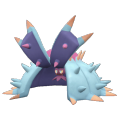</td>
    <td class="centeredText highlightDarkGray"></td>
    <td class="centeredText highlightDarkGray">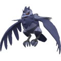</td>
    <td class="centeredText highlightDarkGray">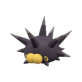</td>
    <td class="centeredText highlightDarkGray"></td>
  </tr>
  <tr>
    <td class="centeredText highlightGray">Toxapex</td>
    <td class="centeredText highlightGray">Mimikyu</td>
    <td class="centeredText highlightGray">Corviknight</td>
    <td class="centeredText highlightGray">Pincurchin</td>
    <td class="centeredText highlightGray">Frosmoth</td>
  </tr>
  <tr>
    <td>Base Type: - Poison / Water</td>
    <td>Base Type: - Ghost / Fairy</td>
    <td>Base Type: - Flying / Steel</td>
    <td>Base Type: - Electric</td>
    <td>Base Type: - Ice / Bug</td>
  </tr>
  <tr>
    <td>Base Stats: 50, 63, 152, 53, 142, 35</td>
    <td>Base Stats: 55, 90, 80, 50, 105, 96</td>
    <td>Base Stats: 98, 87, 105, 53, 85, 67</td>
    <td>Base Stats: 48, 101, 95, 91, 85, 15</td>
    <td>Base Stats: 70, 65, 60, 125, 90, 65</td>
  </tr>
  <tr>
    <td>Stats: - HP: 4750 - Atk: 118 - Def: 307 - Sp.Atk: 100 - Sp.Def: 260 - Speed: 86 - 96 - 105</td>
    <td>Stats: - HP: 4975 - Atk: 167 - Def: 177 - Sp.Atk: 95 - Sp.Def: 194 - Speed: 185 - 206 - 226</td>
    <td>Stats: - HP: 6900 - Atk: 161 - Def: 222 - Sp.Atk: 100 - Sp.Def: 158 - Speed: 138 - 154 - 169</td>
    <td>Stats: - HP: 4650 - Atk: 186 - Def: 204 - Sp.Atk: 168 - Sp.Def: 158 - Speed: 54 - 60 - 66</td>
    <td>Stats: - HP: 5650 - Atk: 122 - Def: 141 - Sp.Atk: 230 - Sp.Def: 167 - Speed: 135 - 150 - 165</td>
  </tr>
  <tr>
    <td>Ability: - Regenerator (HA)</td>
    <td>Ability: - Disguise</td>
    <td>Ability: - Mirror Armor (HA)</td>
    <td>Ability: - Electric Surge (HA)</td>
    <td>Ability: - Ice Scales (HA)</td>
  </tr>
  <tr>
    <td>Moves: - Water Pulse  - Liquidation  - Poison Jab  - Pin Missile </td>
    <td>Moves: - Play Rough  - Shadow Claw  - Shadow Sneak  - Wood Hammer </td>
    <td>Moves: - Iron Head  - Drill Peck  - Body Press  - Hone Claws</td>
    <td>Moves: - Zing Zap  - Thunder  - Surf  - Poison Jab </td>
    <td>Moves: - Blizzard  - Bug Buzz  - Hurricane  - Snowscape</td>
  </tr>
  <tr>
    <td>Actions: - Chilling Water: 95% HP - Toxic: 112 sec - Boss Reset: 50% HP - Player Reset: 180 sec - Chilling Water: 20% HP</td>
    <td>Actions: - Misty Terrain: 45 sec - Boss Reset: 112 sec - Boss Reset: 50% HP - Player Reset: 180 sec - Swords Dance: 30% HP</td>
    <td>Actions: - Tera Reset: 45 sec - Hone Claws: 75% HP - Boss Reset: 50% HP - Player Reset: 180 sec - Tailwind: 30% HP</td>
    <td>Actions: - Thunder Wave: 45 sec - Electric Terrain: 157 sec - Boss Reset: 50% HP - Player Reset: 180 sec - Electric Terrain: 20% HP</td>
    <td>Actions: - Snowscape: 90 sec - Tera Reset: 75% HP - Boss Reset: 50% HP - Player Reset: 180 sec - Quiver Dance: 20% HP</td>
  </tr>
  <tr>
    <td>Shield Trigger: - 70% HP or 202 sec</td>
    <td>Shield Trigger: - 60% HP or 202 sec</td>
    <td>Shield Trigger: - 60% HP or 202 sec</td>
    <td>Shield Trigger: - 60% HP or 202 sec</td>
    <td>Shield Trigger: - 60% HP or 202 sec</td>
  </tr>
  <tr>
    <td>Shield HP: 40%</td>
    <td>Shield HP: 30%</td>
    <td>Shield HP: 35%</td>
    <td>Shield HP: 30%</td>
    <td>Shield HP: 30%</td>
  </tr>
  <tr>
    <td>Herba Mystica: - Salty (3.03%)</td>
    <td>Herba Mystica: - Sour (3.03%)</td>
    <td>Herba Mystica: - Salty (3.03%)</td>
    <td>Herba Mystica: - Spicy (3.05%)</td>
    <td>Herba Mystica: - Sour (3.03%)</td>
  </tr>
  <tr>
    <td colspan="5" class="tableDivider"></td>
  </tr>
  <tr>
    <td class="centeredText highlightDarkGray">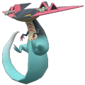</td>
    <td class="centeredText highlightDarkGray">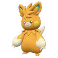</td>
    <td class="centeredText highlightDarkGray"></td>
    <td class="centeredText highlightDarkGray">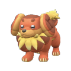</td>
    <td class="centeredText highlightDarkGray">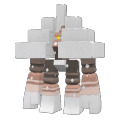</td>
  </tr>
  <tr>
    <td class="centeredText highlightGray">Dragapult</td>
    <td class="centeredText highlightGray">Pawmot</td>
    <td class="centeredText highlightGray">Maushold</td>
    <td class="centeredText highlightGray">Dachsbun</td>
    <td class="centeredText highlightGray">Garganacl</td>
  </tr>
  <tr>
    <td>Base Type: - Dragon / Ghost</td>
    <td>Base Type: - Electric / Fighting</td>
    <td>Base Type: - Normal</td>
    <td>Base Type: - Fairy</td>
    <td>Base Type: - Rock</td>
  </tr>
  <tr>
    <td>Base Stats: 88, 120, 75, 100, 75, 142</td>
    <td>Base Stats: 70, 115, 70, 70, 60, 105</td>
    <td>Base Stats: 74, 75, 70, 65, 75, 111</td>
    <td>Base Stats: 57, 80, 115, 50, 80, 95</td>
    <td>Base Stats: 100, 100, 130, 45, 90, 35</td>
  </tr>
  <tr>
    <td>Stats: - HP: 6450 - Atk: 221 - Def: 168 - Sp.Atk: 185 - Sp.Def: 140 - Speed: 260 - 289 - 317</td>
    <td>Stats: - HP: 5650 - Atk: 212 - Def: 159 - Sp.Atk: 131 - Sp.Def: 113 - Speed: 199 - 222 - 244</td>
    <td>Stats: - HP: 5825 - Atk: 140 - Def: 159 - Sp.Atk: 122 - Sp.Def: 140 - Speed: 209 - 233 - 256</td>
    <td>Stats: - HP: 5050 - Atk: 149 - Def: 240 - Sp.Atk: 95 - Sp.Def: 149 - Speed: 183 - 204 - 224</td>
    <td>Stats: - HP: 7000 - Atk: 185 - Def: 267 - Sp.Atk: 86 - Sp.Def: 167 - Speed: 86 - 96 - 105</td>
  </tr>
  <tr>
    <td>Ability: - Cursed Body (HA)</td>
    <td>Ability: - Iron Fist (HA)</td>
    <td>Ability: - Technician (HA)</td>
    <td>Ability: - Well-Baked Body - Aroma Veil (HA)</td>
    <td>Ability: - Purifying Salt - Sturdy - Clear Body (HA)</td>
  </tr>
  <tr>
    <td>Moves: - Shadow Ball  - Dragon Pulse  - Thunderbolt  - Flamethrower </td>
    <td>Moves: - Wild Charge  - Close Combat  - Double Shock  - Nuzzle </td>
    <td>Moves: - Play Rough  - Take Down  - Low Kick  - Charm</td>
    <td>Moves: - Play Rough  - Double-Edge  - Bite  - Baby-Doll Eyes</td>
    <td>Moves: - Stone Edge  - Heavy Slam  - Salt Cure  - Hammer Arm </td>
  </tr>
  <tr>
    <td>Actions: - Reflect: 67 sec - Tera Reset: 75% HP - Boss Reset: 50% HP - Player Reset: 40% HP - Light Screen: 20% HP</td>
    <td>Actions: - Boss Reset: 22 sec - Tera Reset: 80% HP - Boss Reset: 50% HP - Player Reset: 180 sec - Electric Terrain: 30% HP</td>
    <td>Actions: - Boss Reset: 22 sec - Charm: 112 sec - Boss Reset: 50% HP - Player Reset: 180 sec - Tidy Up: 30% HP</td>
    <td>Actions: - Boss Reset: 22 sec - Tera Reset: 180 sec - Boss Reset: 50% HP - Player Reset: 180 sec - Play Rough: 20% HP</td>
    <td>Actions: - Sandstorm: 90% HP - Tera Reset: 180 sec - Boss Reset: 50% HP - Player Reset: 180 sec - Rock Slide: 20% HP</td>
  </tr>
  <tr>
    <td>Shield Trigger: - 60% HP or 202 sec</td>
    <td>Shield Trigger: - 60% HP or 202 sec</td>
    <td>Shield Trigger: - 60% HP or 202 sec</td>
    <td>Shield Trigger: - 60% HP or 202 sec</td>
    <td>Shield Trigger: - 70% HP or 202 sec</td>
  </tr>
  <tr>
    <td>Shield HP: 30%</td>
    <td>Shield HP: 30%</td>
    <td>Shield HP: 30%</td>
    <td>Shield HP: 30%</td>
    <td>Shield HP: 40%</td>
  </tr>
  <tr>
    <td>Herba Mystica: - Sweet (3.03%)</td>
    <td>Herba Mystica: - Spicy (3.05%)</td>
    <td>Herba Mystica: - Sweet (3.03%)</td>
    <td>Herba Mystica: - Salty (3.03%)</td>
    <td>Herba Mystica: - Salty (3.03%)</td>
  </tr>
  <tr>
    <td colspan="5" class="tableDivider"></td>
  </tr>
  <tr>
    <td class="centeredText highlightDarkGray">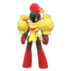</td>
    <td class="centeredText highlightDarkGray">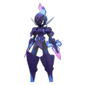</td>
    <td class="centeredText highlightDarkGray">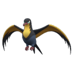</td>
    <td class="centeredText highlightDarkGray">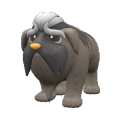</td>
    <td class="centeredText highlightDarkGray">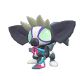</td>
  </tr>
  <tr>
    <td class="centeredText highlightGray">Armarouge</td>
    <td class="centeredText highlightGray">Ceruledge</td>
    <td class="centeredText highlightGray">Kilowattrel</td>
    <td class="centeredText highlightGray">Mabosstiff</td>
    <td class="centeredText highlightGray">Grafaiai</td>
  </tr>
  <tr>
    <td>Base Type: - Fire / Psychic</td>
    <td>Base Type: - Fire / Ghost</td>
    <td>Base Type: - Electric / Flying</td>
    <td>Base Type: - Dark</td>
    <td>Base Type: - Poison / Normal</td>
  </tr>
  <tr>
    <td>Base Stats: 85, 60, 100, 125, 80, 75</td>
    <td>Base Stats: 75, 125, 80, 60, 100, 85</td>
    <td>Base Stats: 70, 70, 60, 105, 60, 125</td>
    <td>Base Stats: 80, 120, 90, 60, 70, 85</td>
    <td>Base Stats: 63, 95, 65, 80, 72, 110</td>
  </tr>
  <tr>
    <td>Stats: - HP: 6325 - Atk: 113 - Def: 213 - Sp.Atk: 230 - Sp.Def: 149 - Speed: 151 - 168 - 184</td>
    <td>Stats: - HP: 5875 - Atk: 230 - Def: 177 - Sp.Atk: 113 - Sp.Def: 185 - Speed: 167 - 186 - 204</td>
    <td>Stats: - HP: 5650 - Atk: 131 - Def: 141 - Sp.Atk: 194 - Sp.Def: 113 - Speed: 232 - 258 - 283</td>
    <td>Stats: - HP: 6100 - Atk: 221 - Def: 195 - Sp.Atk: 113 - Sp.Def: 131 - Speed: 167 - 186 - 204</td>
    <td>Stats: - HP: 5325 - Atk: 176 - Def: 150 - Sp.Atk: 149 - Sp.Def: 134 - Speed: 207 - 231 - 254</td>
  </tr>
  <tr>
    <td>Ability: - Weak Armor (HA)</td>
    <td>Ability: - Weak Armor (HA)</td>
    <td>Ability: - Competitive (HA)</td>
    <td>Ability: - Stakeout (HA)</td>
    <td>Ability: - Prankster (HA)</td>
  </tr>
  <tr>
    <td>Moves: - Armor Cannon  - Psychic  - Night Shade  - Will-O-Wisp</td>
    <td>Moves: - Bitter Blade  - Shadow Claw  - Psycho Cut  - Will-O-Wisp</td>
    <td>Moves: - Hurricane  - Thunder  - Uproar  - Scary Face</td>
    <td>Moves: - Crunch  - Reversal  - Outrage  - Take Down </td>
    <td>Moves: - Knock Off  - Gunk Shot  - Take Down  - Flatter</td>
  </tr>
  <tr>
    <td>Actions: - Calm Mind: 45 sec - Tera Reset: 157 sec - Boss Reset: 50% HP - Player Reset: 180 sec - Sunny Day: 20% HP</td>
    <td>Actions: - Boss Reset: 67 sec - Will-O-Wisp: 157 sec - Boss Reset: 50% HP - Player Reset: 180 sec - Sunny Day: 20% HP</td>
    <td>Actions: - Charge: 90% HP - Tera Reset: 67 sec - Boss Reset: 50% HP - Player Reset: 180 sec - Rain Dance: 20% HP</td>
    <td>Actions: - Taunt: 90 sec - Tera Reset: 75% HP - Boss Reset: 50% HP - Player Reset: 180 sec - Player Reset: 20% HP</td>
    <td>Actions: - Boss Reset: 22 sec - Toxic: 75% HP - Boss Reset: 50% HP - Player Reset: 180 sec - Gunk Shot: 20% HP</td>
  </tr>
  <tr>
    <td>Shield Trigger: - 65% HP or 202 sec</td>
    <td>Shield Trigger: - 60% HP or 202 sec</td>
    <td>Shield Trigger: - 60% HP or 202 sec</td>
    <td>Shield Trigger: - 60% HP or 202 sec</td>
    <td>Shield Trigger: - 60% HP or 202 sec</td>
  </tr>
  <tr>
    <td>Shield HP: 35%</td>
    <td>Shield HP: 30%</td>
    <td>Shield HP: 30%</td>
    <td>Shield HP: 30%</td>
    <td>Shield HP: 30%</td>
  </tr>
  <tr>
    <td>Herba Mystica: - Bitter (3.03%)</td>
    <td>Herba Mystica: - Spicy (3.05%)</td>
    <td>Herba Mystica: - Sweet (3.03%)</td>
    <td>Herba Mystica: - Spicy (3.05%)</td>
    <td>Herba Mystica: - Sweet (3.03%)</td>
  </tr>
  <tr>
    <td colspan="5" class="tableDivider"></td>
  </tr>
  <tr>
    <td class="centeredText highlightDarkGray">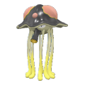</td>
    <td class="centeredText highlightDarkGray"></td>
    <td class="centeredText highlightDarkGray"></td>
    <td class="centeredText highlightDarkGray">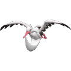</td>
    <td class="centeredText highlightDarkGray">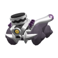</td>
  </tr>
  <tr>
    <td class="centeredText highlightGray">Toedscruel</td>
    <td class="centeredText highlightGray">Klawf</td>
    <td class="centeredText highlightGray">Tinkaton</td>
    <td class="centeredText highlightGray">Bombirdier</td>
    <td class="centeredText highlightGray">Revavroom</td>
  </tr>
  <tr>
    <td>Base Type: - Ground / Grass</td>
    <td>Base Type: - Rock</td>
    <td>Base Type: - Fairy / Steel</td>
    <td>Base Type: - Flying / Dark</td>
    <td>Base Type: - Steel / Poison</td>
  </tr>
  <tr>
    <td>Base Stats: 80, 70, 65, 80, 120, 100</td>
    <td>Base Stats: 70, 100, 115, 35, 55, 75</td>
    <td>Base Stats: 85, 75, 77, 70, 105, 94</td>
    <td>Base Stats: 70, 103, 85, 60, 85, 82</td>
    <td>Base Stats: 80, 119, 90, 54, 67, 90</td>
  </tr>
  <tr>
    <td>Stats: - HP: 6100 - Atk: 131 - Def: 150 - Sp.Atk: 149 - Sp.Def: 221 - Speed: 191 - 213 - 234</td>
    <td>Stats: - HP: 5650 - Atk: 185 - Def: 240 - Sp.Atk: 68 - Sp.Def: 104 - Speed: 151 - 168 - 184</td>
    <td>Stats: - HP: 6325 - Atk: 140 - Def: 172 - Sp.Atk: 131 - Sp.Def: 194 - Speed: 182 - 203 - 223</td>
    <td>Stats: - HP: 5650 - Atk: 190 - Def: 186 - Sp.Atk: 113 - Sp.Def: 158 - Speed: 162 - 181 - 199</td>
    <td>Stats: - HP: 6100 - Atk: 219 - Def: 195 - Sp.Atk: 102 - Sp.Def: 125 - Speed: 175 - 195 - 214</td>
  </tr>
  <tr>
    <td>Ability: - Mycelium Might</td>
    <td>Ability: - Regenerator (HA)</td>
    <td>Ability: - Pickpocket (HA)</td>
    <td>Ability: - Rocky Payload (HA)</td>
    <td>Ability: - Filter (HA)</td>
  </tr>
  <tr>
    <td>Moves: - Energy Ball  - Earth Power  - Spore - Hex </td>
    <td>Moves: - Stone Edge  - Rock Smash  - X-Scissor  - Sandstorm</td>
    <td>Moves: - Gigaton Hammer  - Play Rough  - Knock Off  - Thunder Wave</td>
    <td>Moves: - Rock Slide  - Acrobatics  - Knock Off  - Feather Dance</td>
    <td>Moves: - Gunk Shot  - Overheat  - Iron Head  - Taunt</td>
  </tr>
  <tr>
    <td>Actions: - Grassy Terrain: 90% HP - Spore: 112 sec - Boss Reset: 50% HP - Player Reset: 180 sec - Spore: 25% HP</td>
    <td>Actions: - Boss Reset: 22 sec - Knock Off: 80% HP - Boss Reset: 49% HP - Player Reset: 180 sec - Iron Defense: 30% HP</td>
    <td>Actions: - Misty Terrain: 45 sec - Boss Reset: 75% HP - Boss Reset: 50% HP - Player Reset: 180 sec - Sweet Kiss: 30% HP - Sweet Kiss: 15% HP</td>
    <td>Actions: - Knock Off: 90 sec - Tera Reset: 75% HP - Boss Reset: 50% HP - Player Reset: 180 sec - Feather Dance: 30% HP</td>
    <td>Actions: - Scary Face: 67 sec - Tera Reset: 75% HP - Boss Reset: 50% HP - Shift Gear: 40% HP - Shift Gear: 20% HP</td>
  </tr>
  <tr>
    <td>Shield Trigger: - 60% HP or 202 sec</td>
    <td>Shield Trigger: - 65% HP or 202 sec</td>
    <td>Shield Trigger: - 60% HP or 202 sec</td>
    <td>Shield Trigger: - 60% HP or 202 sec</td>
    <td>Shield Trigger: - 60% HP or 202 sec</td>
  </tr>
  <tr>
    <td>Shield HP: 30%</td>
    <td>Shield HP: 35%</td>
    <td>Shield HP: 30%</td>
    <td>Shield HP: 30%</td>
    <td>Shield HP: 30%</td>
  </tr>
  <tr>
    <td>Herba Mystica: - Sour (3.03%)</td>
    <td>Herba Mystica: - Salty (3.03%)</td>
    <td>Herba Mystica: - Sour (3.03%)</td>
    <td>Herba Mystica: - Spicy (3.05%)</td>
    <td>Herba Mystica: - Spicy (3.05%)</td>
  </tr>
  <tr>
    <td colspan="5" class="tableDivider"></td>
  </tr>
  <tr>
    <td class="centeredText highlightDarkGray"></td>
    <td class="centeredText highlightDarkGray"></td>
    <td class="centeredText highlightDarkGray"></td>
    <td class="centeredText highlightDarkGray"></td>
    <td class="centeredText highlightDarkGray"></td>
  </tr>
  <tr>
    <td class="centeredText highlightGray">Cyclizar</td>
    <td class="centeredText highlightGray">Orthworm</td>
    <td class="centeredText highlightGray">Glimmora</td>
    <td class="centeredText highlightGray">Cetitan</td>
    <td class="centeredText highlightGray">Dondozo</td>
  </tr>
  <tr>
    <td>Base Type: - Dragon / Normal</td>
    <td>Base Type: - Steel</td>
    <td>Base Type: - Rock / Poison</td>
    <td>Base Type: - Ice</td>
    <td>Base Type: - Water</td>
  </tr>
  <tr>
    <td>Base Stats: 70, 95, 65, 85, 65, 121</td>
    <td>Base Stats: 70, 85, 145, 60, 55, 65</td>
    <td>Base Stats: 83, 55, 90, 130, 81, 86</td>
    <td>Base Stats: 170, 113, 65, 45, 55, 73</td>
    <td>Base Stats: 150, 100, 115, 65, 65, 35</td>
  </tr>
  <tr>
    <td>Stats: - HP: 5650 - Atk: 176 - Def: 150 - Sp.Atk: 158 - Sp.Def: 122 - Speed: 225 - 251 - 276</td>
    <td>Stats: - HP: 5650 - Atk: 158 - Def: 294 - Sp.Atk: 113 - Sp.Def: 104 - Speed: 135 - 150 - 165</td>
    <td>Stats: - HP: 6225 - Atk: 104 - Def: 195 - Sp.Atk: 239 - Sp.Def: 150 - Speed: 169 - 188 - 206</td>
    <td>Stats: - HP: 10150 - Atk: 208 - Def: 150 - Sp.Atk: 86 - Sp.Def: 104 - Speed: 148 - 165 - 181</td>
    <td>Stats: - HP: 9250 - Atk: 185 - Def: 240 - Sp.Atk: 122 - Sp.Def: 122 - Speed: 86 - 96 - 105</td>
  </tr>
  <tr>
    <td>Ability: - Regenerator (HA)</td>
    <td>Ability: - Sand Veil (HA)</td>
    <td>Ability: - Corrosion (HA)</td>
    <td>Ability: - Sheer Force (HA)</td>
    <td>Ability: - Water Veil (HA)</td>
  </tr>
  <tr>
    <td>Moves: - Double-Edge  - Dragon Claw  - Dragon Pulse  - Knock Off </td>
    <td>Moves: - Iron Head  - Earthquake  - Smack Down  - Sandstorm</td>
    <td>Moves: - Power Gem  - Sludge Wave  - Hyper Beam  - Rock Polish</td>
    <td>Moves: - Ice Spinner  - Body Slam  - Snowscape - Stomping Tantrum </td>
    <td>Moves: - Wave Crash  - Order Up  - Heavy Slam  - Yawn</td>
  </tr>
  <tr>
    <td>Actions: - Boss Reset: 22 sec - Knock Off: 90 sec - Boss Reset: 50% HP - Player Reset: 180 sec - Shift Gear: 20% HP</td>
    <td>Actions: - Coil: 22 sec - Sandstorm: 80% HP - Boss Reset: 50% HP - Player Reset: 180 sec - Sandstorm: 20% HP</td>
    <td>Actions: - Sandstorm: 90% HP - Tera Reset: 67 sec - Boss Reset: 50% HP - Player Reset: 180 sec - Tera Reset: 55% HP - Tera Reset: 225 sec</td>
    <td>Actions: - Boss Reset: 22 sec - Snowscape: 112 sec - Boss Reset: 50% HP - Player Reset: 180 sec - Yawn: 30% HP</td>
    <td>Actions: - Boss Reset: 22 sec - Rain Dance: 75% HP - Boss Reset: 50% HP - Player Reset: 180 sec - Curse: 20% HP</td>
  </tr>
  <tr>
    <td>Shield Trigger: - 60% HP or 202 sec</td>
    <td>Shield Trigger: - 35% HP or 202 sec</td>
    <td>Shield Trigger: - 60% HP or 202 sec</td>
    <td>Shield Trigger: - 65% HP or 202 sec</td>
    <td>Shield Trigger: - 70% HP or 202 sec</td>
  </tr>
  <tr>
    <td>Shield HP: 30%</td>
    <td>Shield HP: 35%</td>
    <td>Shield HP: 30%</td>
    <td>Shield HP: 35%</td>
    <td>Shield HP: 40%</td>
  </tr>
  <tr>
    <td>Herba Mystica: - Sweet (3.03%)</td>
    <td>Herba Mystica: - Salty (3.03%)</td>
    <td>Herba Mystica: - Bitter (3.03%)</td>
    <td>Herba Mystica: - Spicy (3.03%) - Sweet (3.03%) - Salty (3.03%) - Bitter (3.03%) - Sour (3.03%)</td>
    <td>Herba Mystica: - Spicy (3.03%) - Sweet (3.03%) - Salty (3.03%) - Bitter (3.03%) - Sour (3.03%)</td>
  </tr>
  <tr>
    <td colspan="5" class="tableDivider"></td>
  </tr>
  <tr>
    <td class="centeredText highlightDarkGray"></td>
    <td class="centeredText highlightDarkGray"></td>
    <td class="centeredText highlightDarkGray"></td>
    <td class="centeredText highlightDarkGray"></td>
    <td class="centeredText highlightDarkGray"></td>
  </tr>
  <tr>
    <td class="centeredText highlightGray">Annihilape</td>
    <td class="centeredText highlightGray">Clodsire</td>
    <td class="centeredText highlightGray">Farigiraf</td>
    <td class="centeredText highlightGray">Kingambit</td>
    <td class="centeredText highlightGray">Baxcalibur</td>
  </tr>
  <tr>
    <td>Base Type: - Fighting / Ghost</td>
    <td>Base Type: - Poison / Ground</td>
    <td>Base Type: - Normal / Psychic</td>
    <td>Base Type: - Dark / Steel</td>
    <td>Base Type: - Dragon / Ice</td>
  </tr>
  <tr>
    <td>Base Stats: 110, 115, 80, 50, 90, 90</td>
    <td>Base Stats: 130, 75, 60, 45, 100, 20</td>
    <td>Base Stats: 120, 90, 70, 110, 70, 60</td>
    <td>Base Stats: 100, 135, 120, 60, 85, 50</td>
    <td>Base Stats: 115, 145, 92, 75, 86, 87</td>
  </tr>
  <tr>
    <td>Stats: - HP: 7450 - Atk: 212 - Def: 177 - Sp.Atk: 95 - Sp.Def: 167 - Speed: 175 - 195 - 214</td>
    <td>Stats: - HP: 8350 - Atk: 140 - Def: 141 - Sp.Atk: 86 - Sp.Def: 185 - Speed: 62 - 69 - 75</td>
    <td>Stats: - HP: 7900 - Atk: 167 - Def: 159 - Sp.Atk: 203 - Sp.Def: 131 - Speed: 126 - 141 - 155</td>
    <td>Stats: - HP: 7000 - Atk: 248 - Def: 249 - Sp.Atk: 113 - Sp.Def: 158 - Speed: 110 - 123 - 135</td>
    <td>Stats: - HP: 7675 - Atk: 266 - Def: 199 - Sp.Atk: 140 - Sp.Def: 159 - Speed: 171 - 190 - 209</td>
  </tr>
  <tr>
    <td>Ability: - Defiant (HA)</td>
    <td>Ability: - Poison Point - Water Absorb - Unaware (HA)</td>
    <td>Ability: - Sap Sipper (HA)</td>
    <td>Ability: - Pressure (HA)</td>
    <td>Ability: - Thermal Exchange - Ice Body (HA)</td>
  </tr>
  <tr>
    <td>Moves: - Close Combat  - Shadow Claw  - Assurance  - Focus Energy</td>
    <td>Moves: - Earthquake  - Poison Jab  - Megahorn  - Yawn</td>
    <td>Moves: - Twin Beam  - Hyper Voice  - Low Kick  - Uproar </td>
    <td>Moves: - Iron Head  - Night Slash  - Kowtow Cleave  - Thunder Wave</td>
    <td>Moves: - Icicle Spear  - Dragon Rush  - Snowscape - Body Press </td>
  </tr>
  <tr>
    <td>Actions: - Boss Reset: 22 sec - Bulk Up: 90% HP - Boss Reset: 50% HP - Player Reset: 180 sec - Bulk Up: 25% HP - Rage Fist: 427 sec</td>
    <td>Actions: - Player Reset: 22 sec - Yawn: 75% HP - Boss Reset: 50% HP - Player Reset: 180 sec - Earthquake: 20% HP</td>
    <td>Actions: - Agility: 45 sec - Psychic Terrain: 112 sec - Boss Reset: 50% HP - Player Reset: 180 sec - Uproar: 20% HP</td>
    <td>Actions: - Boss Reset: 67 sec - Tera Reset: 157 sec - Boss Reset: 50% HP - Player Reset: 180 sec - Swords Dance: 20% HP</td>
    <td>Actions: - Snowscape: 90 sec - Tera Reset: 75% HP - Boss Reset: 50% HP - Snowscape: 40% HP - Player Reset: 20% HP</td>
  </tr>
  <tr>
    <td>Shield Trigger: - 65% HP or 202 sec</td>
    <td>Shield Trigger: - 70% HP or 202 sec</td>
    <td>Shield Trigger: - 65% HP or 202 sec</td>
    <td>Shield Trigger: - 65% HP or 202 sec</td>
    <td>Shield Trigger: - 65% HP or 202 sec</td>
  </tr>
  <tr>
    <td>Shield HP: 35%</td>
    <td>Shield HP: 40%</td>
    <td>Shield HP: 35%</td>
    <td>Shield HP: 35%</td>
    <td>Shield HP: 35%</td>
  </tr>
  <tr>
    <td>Herba Mystica: - Spicy (3.05%)</td>
    <td>Herba Mystica: - Sour (3.03%)</td>
    <td>Herba Mystica: - Spicy (3.03%) - Sweet (3.03%) - Salty (3.03%) - Bitter (3.03%) - Sour (3.03%)</td>
    <td>Herba Mystica: - Spicy (3.05%)</td>
    <td>Herba Mystica: - Spicy (3.05%)</td>
  </tr>
</table>
